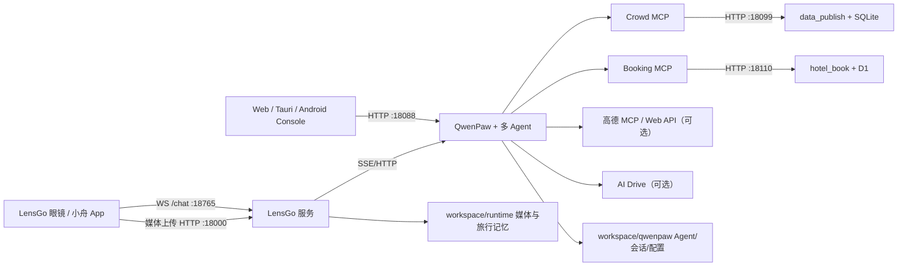

# 项目架构与文件说明（AI 交接入口）

> 最后核验：2026-08-20（Windows，Asia/Shanghai）  
> 当前项目根目录：`Z:\qwen_compitition\final_work`  
> 用途：让下一位开发者或 AI 在一次阅读内理解系统边界、事实源、关键文件、数据流和维护风险。

## 0. 先读这几条

1. 用户最初描述的 `Z:\qwen\_compitition\final\_work` 并不存在；实际目录是 `Z:\qwen_compitition\final_work`。
2. 权威运行源码只认 `project_backend\middle_stage` 下的三个模块。`project_front` 是前端抽取镜像，不是完整启动入口。
3. 当前工作树包含未提交但正在使用的功能，不能执行 `git reset --hard`、`git clean`，也不能只靠 `git archive` 搬家。
4. 当前集成端口以 `Qwen_competion\config\lensgo.integrated.toml` 为准：QwenPaw `18088`、LensGo WebSocket `18765`、LensGo HTTP/Bridge `18000`。
5. `.env`、`.dev.vars`、`workspace`、`data` 中有密钥和真实运行数据。阅读、复制和迁移时不要把值写进文档、聊天或 Git。
6. 本文把项目自有源码逐文件或按紧密功能组说明；`node_modules`、虚拟环境、Rust 构建缓存等三十多万个第三方/生成文件按目录归组，不逐个枚举。

## 1. 一句话理解项目

这是一个澳门智慧旅行演示系统：LensGo 眼镜/手机把文字、图片和视频送入 LensGo 服务，QwenPaw 多 Agent 负责旅行规划和多模态交互，酒店服务负责酒店/账单/支付授权，人流服务负责地图化的实时人流发布与查询。

## 2. 事实源与阅读优先级

```text
当前工作树中的源码和活动配置
  > 当前 git diff / git status
  > 根目录的三份长期说明文档
  > ai_handoff 中按时间记录的 AI 交接日志
  > 2026-08 的旧 HANDOFF、project_describe
  > 2026-07 阶段文档和 zip 压缩包
```

不要把以下内容当作当前事实源：

- `project_backend\middle_stage\zip\`：旧交付压缩包，早于当前代码。
- `project_backend\middle_stage\ai_handoff\`：旧服务器交接快照。
- `project_backend\middle_stage\project_describe`：旧远端运行快照。
- `Qwen_competion\qwen_compitition\START_LOCAL.md`：上游/旧路径启动说明。
- `lensgo-macao\run_all.sh`、`run_gateway.sh`：独立模块旧启动链，端口与当前一体化配置不同。

## 3. 总体架构



### 当前端口

| 端口 | 服务 | 主要入口 | 说明 |
|---:|---|---|---|
| `18088` | QwenPaw | `/`、`/api/version` | Console 与 Agent API |
| `18765` | LensGo WebSocket | `/chat` | 眼镜/小舟长连接 |
| `18000` | LensGo HTTP/Bridge | `/api/bridge/*` 等 | 状态、事件、媒体上传 |
| `18099` | data_publish | `/`、`/api/health` | 人流发布 UI 与 API |
| `18110` | hotel_book | `/`、`/api/v1/*` | 酒店前端与 API |
| `8000` | AI Drive/旧 Gateway | 依部署而定 | 可选，不属于默认统一启动 |

`18866` 是旧阶段说明中的 LensGo HTTP 端口；当前一体化运行不要使用它。LensGo 子模块自己的旧默认值仍可能保留，用外层 `integrated.py` 启动时会被 TOML 覆盖。

## 4. 根目录结构

```text
final_work/
├─ 01_项目架构与文件说明.md  # 长期架构与文件职责说明
├─ 02_本地启动指南.md        # 本地前后端启动教学
├─ 03_服务器迁移部署指南.md  # 服务器迁移与部署说明
├─ ai_handoff/               # 每次 AI 工作的增量交接记录
│  ├─ README.md              # 交接目录的写法和安全边界
│  └─ YYYY-MM-DD_HHMM_主题.md # 每次任务新增一份，不覆盖旧记录
├─ project_backend/
│  └─ middle_stage/
│     ├─ Qwen_competion/       # LensGo + QwenPaw + Console/Tauri/Android
│     ├─ hotel_book/           # 酒店、账单、支付授权、景点、行程费用
│     ├─ data_publish/         # 人流发布、地图、鉴权、SQLite
│     ├─ ai_handoff/           # 历史服务器快照
│     ├─ zip/                  # 历史压缩包
│     ├─ project_describe      # 历史远端 Agent 快照
│     └─ frpc.ini*.pending     # 历史/待应用 FRP 配置
└─ project_front/
   └─ middle_stage/
      ├─ Qwen_competion/       # Qwen Console/Tauri/Android 镜像
      ├─ hotel_book/           # 酒店前端镜像，不含完整 API
      ├─ data_publish/         # 人流静态前端镜像，不含 Python
      ├─ project_describe      # 镜像规则说明
      └─ .gitignore
```

### 4.1 `ai_handoff` 文件夹使用说明

根目录三份编号文档用于描述长期稳定的项目事实；`ai_handoff` 用于记录每一次 AI 实际做过的增量工作，帮助下一位 AI 在不重做审计的情况下继续推进。两者不能混用：架构、启动方式或部署方式发生长期变化时更新编号文档；一次任务的操作过程、验证结果和遗留问题写入 `ai_handoff`。

每位 AI 开始工作时：

1. 先阅读根目录的三份编号文档。
2. 再阅读 `ai_handoff\README.md`，并按文件名时间顺序阅读最近的交接记录。
3. 对照根仓库和三个子仓库的 `git status --short`，确认交接描述与当前工作树一致；源码和活动配置始终高于旧交接记录。

每位 AI 完成一项有实际影响的任务后，在 `ai_handoff` 新建一份 Markdown，推荐命名为 `YYYY-MM-DD_HHMM_简短主题.md`。一份记录至少包含：

- 用户目标与本次工作范围；
- 修改过的文件及关键改动；
- 执行过的命令、构建、测试和实际结果；
- 当前正在运行的服务、端口和临时操作状态；
- 尚未解决的问题、风险和建议的下一步；
- Git 提交或版本标签（如果本次产生）。

交接记录采用“每次新增、禁止覆盖历史”的方式。修正旧记录时也应新增一份更正记录，并明确指出被更正的文件。严禁把 `.env`、`.dev.vars`、Token、密码、API Key、Cookie、私密工作区内容、用户照片或完整运行日志写入 `ai_handoff`；敏感信息只能描述为“已配置/未配置”和所在的受保护文件路径。

## 5. `data_publish`：人流发布服务

### 自有文件

| 文件 | 作用 |
|---|---|
| `run.py` | CLI 总入口：加载配置、初始化/重建数据库、创建管理员/API Key、启动 HTTP 服务。 |
| `启动发布器.bat` | Windows 双击启动包装器。 |
| `.env.example` | 不含真实密钥的配置模板。 |
| `.env` | 当前机器私密配置；禁止提交或复制到文档。 |
| `.gitignore` | 排除密钥、数据库、凭据、日志和缓存。 |
| `README.md` | 当前启动、鉴权与 API 说明。 |
| `项目说明.md` | 设计背景；部分“尚未实现”描述已经过时。 |
| `app/__init__.py` | Python 包标记。 |
| `app/config.py` | `.env`、主机/端口、角色、scope、Cookie、过期时间和拥挤阈值配置。 |
| `app/geo.py` | WGS-84 到 GCJ-02 坐标转换。 |
| `app/amap.py` | 服务端高德 Web API 客户端：搜索、周边查询、逆地理编码。 |
| `app/db.py` | SQLite 建表和增量迁移。 |
| `app/store.py` | 城市/区域、发布批次、读数、撤销、历史、最新密度等核心业务层。 |
| `app/auth.py` | 密码哈希、登录、会话、CSRF、API Key、角色/scope、限速和审计。 |
| `app/api.py` | 标准库 HTTP 路由、鉴权分发、静态文件、Cookie/CORS 和错误响应。 |
| `app/seed_data.py` | 澳门城市、区域、街道和 POI 初始数据。 |
| `web/index.html` | 登录后的主发布器页面。 |
| `web/app.js` | Leaflet 地图、搜索、发布/撤销、最近地点、用户/API Key 管理。 |
| `web/styles.css` | 页面与 Leaflet 布局。 |
| `web/login.html`、`web/login.js` | 登录页面和登录请求。 |
| `web/vendor/leaflet.*` | 本地化的 Leaflet 第三方静态资源。 |
| `web/tests/auth_ui_static_test.js` | 登录/鉴权页面静态回归测试。 |
| `tests/test_auth.py` | 后端登录、角色、scope、CSRF 和 API Key 回归。 |
| `versions/*.md` | 各阶段版本说明。 |

### 运行数据

`data/crowd.db` 目前包含：

```text
cities, regions, batches, readings,
users, sessions, api_keys, audit_logs,
login_attempts, schema_migrations
```

`data/` 下的数据库、管理员凭据文件和日志属于私密运行资产，不是源码。坐标使用 GCJ-02；“没有读数”是 `null`，不等于 0 人。

## 6. `hotel_book`：酒店与费用服务

### 页面与业务核心

| 文件 | 作用 |
|---|---|
| `app/page.tsx` | 页面入口。 |
| `app/layout.tsx` | HTML 布局和 metadata。 |
| `app/hotel-app.tsx` | 酒店搜索、预订、账单调整和支付授权主 UI。 |
| `app/globals.css` | 全局样式。 |
| `app/chatgpt-auth.ts` | ChatGPT/Sites 用户身份适配辅助。 |
| `lib/hotel-store.ts` | 当前权威 D1 数据层：身份、建表/迁移、播种、库存、报价、预订、账单、支付授权和活动。 |
| `lib/trip-expenses.ts` | 景点票价和行程费用 CRUD/汇总。 |

### API 文件

| 文件 | 作用 |
|---|---|
| `app/api/v1/state/route.ts` | 聚合账单、授权和活动状态。 |
| `app/api/v1/hotels/search/route.ts` | 酒店和可售库存查询。 |
| `app/api/v1/inventory/route.ts` | 库存查询/更新。 |
| `app/api/v1/quotes/route.ts` | 创建预订报价。 |
| `app/api/v1/bookings/route.ts` | 确认预订。 |
| `app/api/v1/bills/route.ts` | 账单列表与创建。 |
| `app/api/v1/bills/[id]/route.ts` | 单个账单详情。 |
| `app/api/v1/bills/[id]/adjustments/preview/route.ts` | 账单调整预览。 |
| `app/api/v1/bills/[id]/adjustments/confirm/route.ts` | 确认账单调整。 |
| `app/api/v1/payment-authorizations/route.ts` | 一次性/限额/限时付款授权。 |
| `app/api/v1/payment-sessions/route.ts` | 创建授权后的支付会话。 |
| `app/api/v1/attractions/route.ts` | 澳门景点和票价。 |
| `app/api/v1/trip-expenses/route.ts` | 行程费用查询和批量创建。 |
| `app/api/v1/trip-expenses/[id]/route.ts` | 行程费用更新和删除。 |
| `app/api/v1/openapi/route.ts` | 给 Agent/客户端使用的接口说明。 |

### 构建、数据库与测试

| 文件/目录 | 作用 |
|---|---|
| `worker/index.ts` | Vinext Cloudflare Worker 入口及 D1/静态资源绑定。 |
| `vite.config.ts` | Vinext、Sites、Cloudflare 插件与开发配置。 |
| `.openai/hosting.json` | Sites/D1 项目元数据；与部署账号相关。 |
| `build/sites-vite-plugin.ts` | Sites 构建适配。 |
| `scripts/build-static-entry.mjs` | 构建后补静态首页，规避特定 workerd SSR 问题。 |
| `package.json` | 脚本和依赖；必须用 `npm run build`，不能漏掉静态首页步骤。 |
| `package-lock.json` | 锁定 Node 依赖版本。 |
| `tests/rendered-html.test.mjs` | 构建后的 HTML 产品回归。 |
| `public/` | 图标和开放图资源。 |
| `next.config.ts`、`postcss.config.mjs`、`tsconfig.json`、`eslint.config.mjs` | 构建、样式、类型和质量配置。 |
| `db/`、`drizzle/`、`drizzle.config.ts` | 早期 Drizzle 模型/迁移脚手架；当前 API 的完整事实源仍是 `lib/hotel-store.ts`。 |
| `.dev.vars.example` | 无真实 Token 的本地变量模板。 |
| `.dev.vars` | 当前机器私密 Token；禁止提交。 |
| `PLAN.md` | 产品蓝图，不等于当前已实现功能清单。 |

酒店金额在服务端统一以“分”为单位。当前无认证请求可回退演示身份，因此它是演示/内部服务，不是可直接裸露公网的完整多租户身份系统。

## 7. `Qwen_competion`：集成主系统

### 外层集成文件

| 文件 | 作用 |
|---|---|
| `README.md` | 一体化项目入口说明。 |
| `.env.integrated.example` | 集成变量模板。 |
| `.env.integrated` | 当前机器真实配置和密钥；禁止公开。 |
| `config/lensgo.integrated.toml` | 当前 LensGo 主配置与端口事实源。 |
| `scripts/integrated.py` | 总编排器：`doctor`、`bootstrap`、`start`、`app`、`test`；还能在项目搬迁后重基 Agent 工作区路径。 |
| `scripts/bootstrap.ps1/.sh` | 初始化包装器。 |
| `scripts/start.ps1/.sh` | 一体化服务启动包装器。 |
| `scripts/app.ps1` | 启动原生桌面窗口。 |
| `启动 LensGo App.vbs` | Windows 双击入口。 |
| `scripts/build_android.ps1` | Tauri Android 初始化和 APK/AAB 构建。 |
| `scripts/start_android_studio_d.ps1` | 当前机器的 Android Studio/cache 辅助启动器；默认使用 `D:\Android_studio`。 |
| `scripts/android-studio-d.properties` | 与上述 D 盘启动器配套的 JetBrains 缓存路径。 |
| `scripts/start_lensgo_mobile_backend.ps1` | 手机联调：启动 QwenPaw/人流并配置 ADB reverse。 |
| `scripts/mcp/lensgo_booking_server.py` | 酒店/景点/行程费用 MCP。 |
| `scripts/mcp/lensgo_crowd_server.py` | 人流查询 MCP。 |
| `tests/test_integrated_layout.py` | 集成目录、端口、搬迁路径、模板和移动端接线回归。 |
| `tests/test_trip_crowd_integration.py` | 行程与人流连接测试。 |
| `lensgo-qwenpaw.service`、`lensgo-bridge.service` | 旧服务器 systemd 草案；硬编码用户/路径，只能作模板。 |
| `docs/` | 阶段架构、运维、移动端说明；旧记录需结合当前配置阅读。 |
| `workspace/README.md` | 运行数据边界说明。 |

Android 辅助脚本中的 `D:\Android_studio` 是本机移动端构建默认值，不影响 Web 三服务启动；换机器时应通过脚本参数或环境配置替换。手机端旧人流默认地址也可由 App 设置覆盖。

### `lensgo-macao` 设备服务

核心目录是 `lensgo-macao\ai_glasses_debug\glasses`：

| 文件/目录 | 作用 |
|---|---|
| `server/app.py` | 同时启动眼镜 WebSocket 与 HTTP/Bridge。 |
| `server/config.py` | CLI/TOML 配置合并。 |
| `server/ws_handler.py` | `/chat` 会话、文字/图片意图、并发和流管理。 |
| `server/http_routes.py` | 视频/媒体上传与读取路由。 |
| `server/auth.py` | Token/JWT 用户信息处理；当前不是完整生产验签。 |
| `server/media.py` | 媒体解码、类型识别、安全命名和落盘。 |
| `server/lensgo_memory.py` | 共享旅行记忆 SQLite 与上下文注入。 |
| `server/qwenpaw_bridge.py` | QwenPaw SSE 对接、停止请求和生成媒体处理。 |
| `server/qwenpaw_auth_setup.py` | QwenPaw 登录配置初始化。 |
| `server/qwenpaw_auth_refresh.py` | QwenPaw 认证刷新回调。 |
| `server/data_bridge.py` | Bridge 状态、事件订阅和媒体接口。 |
| `server/telegram_agent.py`、`telegram_bridge.py` | Telegram 与 Agent/事件/媒体的桥接。 |
| `server/tts_chunker.py` | 把 SSE 文本切成适合眼镜朗读的块。 |
| `qwenpaw/client.py`、`sse.py`、`types.py` | QwenPaw HTTP/SSE 客户端与类型。 |
| `common/protocol.py` | 眼镜消息协议编解码。 |
| `common/config_toml.py`、`logging_util.py` | TOML 兼容读取与脱敏日志。 |
| `client/` | WebSocket、协议和 MP4 上传联调客户端。 |
| `gateway/app.py` | 旧简化 Gateway，默认不进入一体化主链。 |
| `tests/` | JWT、协议、Bridge、记忆、媒体、Telegram、TTS 和 QwenPaw 集成回归。 |
| `qwenpaw_agents/*/AGENTS.md`、`SOUL.md` | 五个 LensGo Agent 的权威公开模板。 |

五个定制 Agent：

- `lensgo-travel-director`：面向用户的主编排 Agent。
- `lensgo-vision-curator`：照片、视频、构图、光线和风险。
- `lensgo-memory-keeper`：旅程上下文、偏好和重要时刻。
- `lensgo-media-archivist`：媒体去重、隐私和生命周期。
- `lensgo-pose-coach`：姿势、安全、机位和参考图提示词。

### `qwen_compitition` 中的 QwenPaw 上游源码

| 目录/文件 | 作用 |
|---|---|
| `src/qwenpaw/` | Python 后端、Agent 运行时、Provider、Driver、MCP、记忆、安全和 CLI。 |
| `console/` | React/Vite Console 与 Tauri/Android 客户端。 |
| `plugins/` | 插件与内置 bundle。 |
| `deploy/`、`docker-compose.yml` | 上游 QwenPaw 部署资源，不包含本项目全部四个服务。 |
| `scripts/` | 上游构建、发布和维护脚本。 |
| `tests/`、`e2e/` | 上游单元、集成和端到端测试。 |
| `website/` | QwenPaw 官网/文档站，非比赛运行主链。 |
| `.github/` | CI、发布和 Issue 模板。 |
| `working/workspaces/default/` | Skill/Driver 默认模板来源。 |
| `pyproject.toml`、`setup.py` | Python 包、版本和依赖。 |
| `README_*`、`SECURITY.md`、`CONTRIBUTING*` | 上游说明与贡献规范。 |

本项目重点定制文件：

| 文件 | 作用 |
|---|---|
| `src/qwenpaw/app/_app.py` | FastAPI 总入口、路由和 Console 静态资源。 |
| `src/qwenpaw/app/routers/travel_planner.py` | 行程、路线、酒店代理、景点、行程费用和相册回退。 |
| `src/qwenpaw/agents/tools/pose_image.py` | 姿势参考图生成工具。 |
| `src/qwenpaw/app/multi_agent_manager.py` | 多 Agent 生命周期。 |
| `src/qwenpaw/app/workspace/workspace.py` | 单 Agent 工作区、会话、记忆和 Driver 初始化。 |
| `src/qwenpaw/agents/tools/agent_management.py` | Agent 间协作工具。 |
| `working/.../skills/` | 澳门行程、AI Drive、姿势等模板。 |
| `working/.../drivers/mcp/` | 高德/AI Drive 等 Driver 模板。 |

### Console / Tauri / Android

| 文件/目录 | 作用 |
|---|---|
| `console/vite.config.ts` | 构建、测试和开发代理；当前 `/api` 默认代理到 `18088`。 |
| `console/src/App.tsx` | 主路由和界面。 |
| `main.tsx`、`desktopMain.tsx`、`mobileMain.tsx` | Web、桌面、手机入口。 |
| `src/api/` | QwenPaw API 封装。 |
| `src/api/lensgo.ts` | LensGo Bridge 状态、事件和媒体 API。 |
| `src/pages/LensGoDashboard/` | LensGo 控制中心。 |
| `src/layouts/MobileNavigation/` | 响应式手机导航。 |
| `src/mobile-local/MobileLocalApp.tsx` | 手机本地版总 UI。 |
| `src/mobile-local/runtime.ts` | Tauri 调用、本地状态、QwenPaw、酒店和图像能力。 |
| `src/mobile-local/qwenpaw.ts` | QwenPaw SSE 与聊天流。 |
| `src/mobile-local/tripJourney.ts` | 人流、定位、行程解析、地点匹配、路线重排和坐标转换。 |
| `src/mobile-local/tripSync.ts` | Agent 行程建议与本地行程同步。 |
| `src/mobile-local/TripRouteMap.tsx` | 高德地图和路线。 |
| `src/mobile-local/AlbumMap.tsx` | 带坐标照片地图。 |
| `src/mobile-local/HotelBillsPage.tsx` | 账单调整、支付授权和支付。 |
| `src-tauri/src/mobile_runtime.rs` | 原生 HTTP、配置、QwenPaw SSE、人流、酒店、路线、相册和图像命令。 |
| `src-tauri/src/lib.rs` | 注册 Tauri 命令。 |
| `src-tauri/permissions/mobile-runtime.toml` | 移动原生命令权限。 |
| `src-tauri/tauri.android.conf.json` | Android 产品配置。 |
| `gen/android/.../MainActivity.kt` | WebView 初始化和原生桥。 |
| `LensGoTripBridge.kt` | 定位、TTS 和通知 JavaScript Bridge。 |
| `LensGoRuntimeService.kt` | Android 前台常驻服务。 |

其余 `console/src-tauri/backend*.rs`、`tray.rs`、`updates*` 等属于 QwenPaw 桌面外壳通用能力，可按目录职责理解。

## 8. 关键数据流

### 眼镜对话

```text
眼镜/小舟 App
→ LensGo /chat
→ 鉴权、媒体落盘、LensGoMemory 上下文
→ QwenPaw /api/console/chat
→ lensgo-travel-director
→ 按需调用专家 Agent/MCP
→ SSE
→ TTS 分块
→ 眼镜 + Bridge + 可选 Telegram
```

### 酒店与费用

```text
手机 Tauri
→ QwenPaw /api/travel-planner/hotel/*
→ travel_planner.py
→ hotel_book /api/v1/*
→ D1

Travel Director
→ lensgo_booking_server.py
→ 酒店/景点/行程费用 API
```

### 人流与路线

```text
发布人员 → data_publish Web → SQLite crowd.db
手机/Agent → data_publish /api/density/latest
Agent/高德 → latest-itinerary.json → travel_planner.py → 手机 LocalTrip
```

### 相册

QwenPaw 行程相册优先 AI Drive，不可用时回退本地 `lensgo-cloud-album`；眼镜媒体主要进入 `workspace/runtime/lensgo-media`。两者目前没有自动互通，不应被描述成同一个存储。

## 9. `project_front` 的维护规则

`project_front` 是去后端、去密钥的交付/前端镜像：

- `data_publish` 只保留 Web 静态文件；必须由后端同源托管，不能双击 HTML 完成联调。
- `hotel_book` 只保留前端相关文件；缺少完整 `app/api` 和业务数据层，不能单独当完整系统启动。
- `Qwen_competion` 主要保留 Console/Tauri/Android 源码；实际 API 仍在 `project_backend`。

维护顺序必须是：

```text
修改 project_backend 权威源
→ 构建/测试
→ 将对应前端文件同步到 project_front
→ 做哈希/差异检查
```

2026-08-20 已同步 13 个漂移文件，并在端口/代理修复后再次同步 3 个 Qwen Console 文件。

## 10. 生成物、依赖和运行资产

### 不手改、可重建

```text
**/node_modules/
**/.venv/
**/.venv-linux/
**/dist/
**/dist-mobile/
**/.vinext/
**/.wrangler/
**/target/
**/build/
**/__pycache__/
**/.pytest_cache/
tmp/
zip/
*.tsbuildinfo
*.log
*.bak*
*.pending
.recovery-*
```

这些目录占据绝大多数文件数和磁盘空间。清理前仍需确认它们不是当前唯一产物；不要在交接过程中盲目删除。

### 必须单独加密备份

```text
Qwen_competion/workspace/qwenpaw/
Qwen_competion/workspace/qwenpaw.secret/
Qwen_competion/workspace/runtime/
data_publish/data/
hotel_book/.wrangler/state/
Qwen_competion/.env.integrated
data_publish/.env
hotel_book/.dev.vars
```

Agent 模板事实源在 `lensgo-macao/qwenpaw_agents/`；`workspace/qwenpaw/workspaces/` 是实例化后、可能被用户修改的运行副本。

## 11. 2026-08-20 环境审计与修复摘要

已完成：

- 确认实际根路径并修正旧的 `final_work` 缺失路径。
- 重建 `.venv` 中 QwenPaw/Glasses 的 editable 安装指向。
- 修正 `.env.integrated` 的 Crowd/Hotel 路径，不改动任何密钥值。
- 修正活动 MCP Driver 的 Python、脚本和输出路径。
- 修正已实例化的 7 个 Agent `workspace_dir`，并让 `bootstrap` 在以后搬家时自动重基路径。
- `doctor` 新增 editable 安装、测试依赖、外部服务、持久化 Agent 路径和动态端口检查。
- LensGo 桌面 App 的端口检查改为读取 TOML，不再硬编码旧 `18866`。
- Qwen Console 开发代理由旧 `8088` 改为可配置的 `VITE_DEV_PROXY_TARGET`，默认 `18088`。
- 修正活动 UI 与文档中的 LensGo HTTP 地址为 `18000`。
- 把 7 个异常路径名的旧运行快照安全归档到 `workspace/legacy-path-artifacts/2026-08-20`，没有删除。
- 同步 `project_front` 漂移文件。

验证结果：

- `integrated.py doctor`：`0 error(s)`。
- 集成布局回归：`10/10` 通过。
- 人流静态 UI 测试：通过。
- 酒店 `npm run test`（包含完整构建）：通过。
- Qwen Console 生产构建：通过；仅有现存的大 chunk/循环 chunk 警告。
- 人流 `/api/health`：HTTP 200。
- 酒店 `/`、`/api/v1/openapi`、`/api/v1/state`：HTTP 200。
- QwenPaw `/api/version`：HTTP 200，版本 `2.0.0.post3`；7/7 Agent 从当前 `final_work` 工作区启动。

当前非阻断警告：

- `.venv` 缺少 `pytest`、`pytest-asyncio`，只影响完整 pytest 测试；安全网络安装时再补。此前 PyPI TLS 连接异常，没有采用跳过证书验证的方式。
- AMap MCP 和 AI Drive MCP 未在本机配置；它们是可选外部服务，不影响核心本地 Web 启动。
- Android/ADB/Docker/WSL 不是本地 Web 启动必需项。

## 12. 给下一位 AI 的交接检查表

开始修改前：

1. 读完本文件，再读 `02_本地启动指南.md`、`03_服务器迁移部署指南.md`、`ai_handoff\README.md` 和最新交接记录。
2. 执行 `git status --short`（根仓库和三个子仓库分别检查），保留用户已有修改和未跟踪业务文件。
3. 运行 `Qwen_competion\.venv\Scripts\python.exe scripts\integrated.py doctor`。
4. 以 `project_backend` 为唯一源码事实源；不要直接在 `project_front` 独立开发。
5. 搜索旧绝对路径和端口时，区分“活动配置”与“历史备份/上游默认”。
6. 不输出任何 `.env`、`.dev.vars`、Token、密码、API Key 或私密 workspace 内容。

交付前：

1. 运行与改动范围相称的构建和测试。
2. 如改前端，同步 `project_front` 并校验哈希。
3. 检查端口仍以 `18088/18765/18000/18099/18110` 为准。
4. 长期事实发生变化时更新根目录三份说明文档；无论是否变化，都为本次实际工作新增一份 `ai_handoff` 交接记录。
