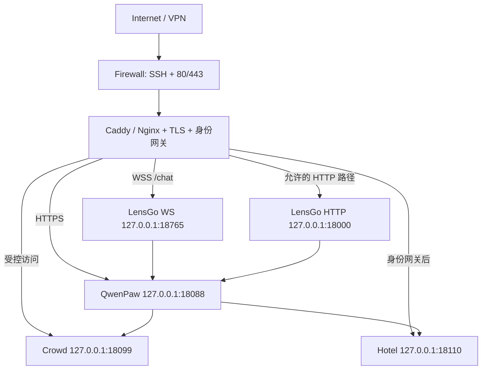

# 服务器迁移与部署指南（Linux）

> 最后审计：2026-08-20  
> 推荐方案：Linux + systemd + Caddy/Nginx + 四个回环服务  
> 目标：把当前 Windows 工作树迁移到服务器，同时保留 Agent、会话、媒体、人流数据库和酒店 D1 数据。

## 1. 先看结论

当前代码可以迁移，但不能把整个 Z 盘目录原样上传后直接运行：

1. Windows `.venv`、`node_modules`、Rust `target` 和构建缓存不能跨平台复用，必须在 Linux 重建。
2. 当前工作树有未提交业务文件，不能只用 `git clone` 或 `git archive`；必须从当前工作树打包/同步。
3. 现有 `lensgo-qwenpaw.service`、`lensgo-bridge.service` 硬编码旧用户名、旧 `/home/...` 路径和 `.venv-linux`，只能作为历史模板。
4. Linux `bootstrap` 实际创建 `Qwen_competion/.venv`，systemd 应使用 `.venv/bin/python` 和 `.venv/bin/qwenpaw`。
5. QwenPaw Agent 的 `workspace_dir` 已支持由 `bootstrap` 自动重基；MCP YAML 中的 Windows绝对路径仍需迁移后检查。
6. LensGo、QwenPaw 和酒店当前都有生产鉴权边界，不能直接裸露其本地端口。
7. 推荐只开放 SSH、80、443；`18000/18088/18099/18110/18765/8000` 均保持回环监听。

## 2. 推荐拓扑



推荐域名：

```text
agent.example.com    -> QwenPaw 18088
bridge.example.com   -> /chat 到 18765；有限 HTTP 路径到 18000
crowd.example.com    -> Crowd 18099（可只开放管理 VPN）
hotel.example.com    -> 身份网关后到 Hotel 18110
```

## 3. 迁移前盘点

### 3.1 本机要确认

```powershell
Test-Path 'Z:\qwen_compitition\final_work'

Set-Location 'Z:\qwen_compitition\final_work\project_backend\middle_stage\Qwen_competion'
& .\.venv\Scripts\python.exe .\scripts\integrated.py doctor

git status --short
```

还要分别进入 `data_publish`、`hotel_book`、`Qwen_competion` 的 Git 根检查状态。不要清掉未跟踪文件：酒店的景点/行程费用等功能可能就在其中。

### 3.2 记录但不要公开

- 当前服务版本与 Git commit；
- 数据库/工作区目录大小；
- 需要启用的外部 Provider、Telegram、高德和 AI Drive；
- 旧服务器域名、证书、Caddy/Nginx、systemd 和防火墙状态；
- 所有密钥的“名称和轮换计划”，不要把值写进迁移文档。

### 3.3 迁移窗口

为获得一致数据，最终增量同步前停止会写入数据的四个服务。源码可提前同步，数据库、workspace 和 D1 状态在停写后最后同步。

## 4. 服务器目录布局

建议创建专用用户 `lensgo`，不要用 root 运行应用：

```text
/srv/lensgo/
├─ current -> releases/<发布号>
├─ releases/
│  └─ <发布号>/
│     └─ project_backend/
│        └─ middle_stage/
│           ├─ Qwen_competion/
│           ├─ data_publish/
│           └─ hotel_book/
└─ shared/
   ├─ workspace/
   │  ├─ qwenpaw/
   │  ├─ qwenpaw.secret/
   │  ├─ qwenpaw.backups/
   │  └─ runtime/
   ├─ crowd/
   │  └─ crowd.db
   └─ hotel-wrangler/
      └─ state/

/etc/lensgo/
├─ integrated.env
├─ crowd.env
└─ hotel.env
```

原则：发布目录只放源码和本版构建产物；数据库、会话、媒体、运行配置和密钥放 `shared`/`/etc`，切换 `current` 时不会被覆盖。

## 5. 哪些内容要传，哪些不要传

### 5.1 源码同步时排除

```text
.git/
node_modules/
.venv/
.venv-linux/
dist/
dist-mobile/
build/
target/
.vinext/
.wrangler/
workspace/
data/
__pycache__/
.pytest_cache/
*.log
*.bak*
*.pending
.env*
.dev.vars
zip/
```

不要对服务器持久化目录使用 `rsync --delete`。

可在具备 rsync 的受控终端中按当前工作树同步，示意：

```bash
release=2026-08-20-01
rsync -a \
  --exclude=.git/ \
  --exclude=node_modules/ \
  --exclude=.venv/ \
  --exclude=.venv-linux/ \
  --exclude=target/ \
  --exclude=dist/ \
  --exclude=.wrangler/ \
  --exclude=workspace/ \
  --exclude=data/ \
  --exclude='.env*' \
  --exclude=.dev.vars \
  /path/to/final_work/project_backend/ \
  server:/srv/lensgo/releases/$release/project_backend/
```

Windows 端可使用 SFTP/受控归档工具达到相同效果。迁移包必须来自当前工作树，而不是旧 `zip`。

### 5.2 单独加密迁移的运行资产

```text
Qwen_competion/workspace/qwenpaw/
Qwen_competion/workspace/qwenpaw.secret/
Qwen_competion/workspace/runtime/
data_publish/data/crowd.db
hotel_book/.wrangler/state/
```

旧 workspace 中可能还有历史环境备份、日志和压缩包。优先白名单传输上述目录，不要把整个 workspace 当普通公开源码包。

### 5.3 密钥

这些文件不要混进源码包：

```text
Qwen_competion/.env.integrated
data_publish/.env
hotel_book/.dev.vars
```

在服务器 `/etc/lensgo/*.env` 中重新创建，权限设为仅服务用户可读。正式上线建议轮换：

- Qwen Provider/API Token；
- `GLASSES_BRIDGE_TOKEN`；
- 酒店内部服务 Token；
- Crowd pepper、管理员密码和 API Key；
- Telegram、高德、AI Drive 等第三方凭据。

## 6. 服务器环境

最低检查：

```bash
python3 --version       # 3.11～3.13
node --version          # >= 22.13
npm --version
git --version
sqlite3 --version
systemctl is-system-running
df -h /srv
ss -ltnp
```

还需要：

- Python `venv` 和编译基础工具；
- Node/npm；
- Caddy 或 Nginx；
- `sqlite3`、`curl`、`rg`；
- 如构建 Android，再单独准备 Rust、JDK、Android SDK。生产 Web 服务器不需要 Android 工具链。

Docker 不是必需。QwenPaw 上游 `docker-compose.yml` 使用上游端口并且不包含 LensGo、酒店、人流，不能作为整套项目的一键部署方案。

## 7. 发布目录和持久化链接

以下使用占位发布号，执行前替换：

```bash
release=2026-08-20-01
root=/srv/lensgo/releases/$release/project_backend/middle_stage
```

首次创建持久化目录后，把 Qwen 外层 workspace 和酒店本地状态连接到 shared：

```text
$root/Qwen_competion/workspace -> /srv/lensgo/shared/workspace
$root/hotel_book/.wrangler    -> /srv/lensgo/shared/hotel-wrangler
```

人流服务通过 `--db /srv/lensgo/shared/crowd/crowd.db` 显式指定数据库，无需把整个 `data` 目录连接出去。

只在确认链接目标正确、发布目录中没有需要保留的同名实体后创建链接。不要递归删除不明目录来“腾位置”。

激活发布：

```bash
sudo ln -sfn /srv/lensgo/releases/$release /srv/lensgo/current
```

## 8. Linux 依赖与构建

### 8.1 QwenPaw + LensGo

```bash
cd /srv/lensgo/current/project_backend/middle_stage/Qwen_competion
python3 scripts/integrated.py bootstrap --build-console
python3 scripts/integrated.py doctor
```

完成后应存在：

```text
.venv/bin/python
.venv/bin/qwenpaw
qwen_compitition/console/dist/index.html
```

不要使用从 Windows 复制的 `.venv`，也不要默认使用旧 `.venv-linux`。

### 8.2 酒店

```bash
cd /srv/lensgo/current/project_backend/middle_stage/hotel_book
npm ci --registry=https://registry.npmjs.org
npm run test
```

`npm run test` 会先执行项目规定的完整构建，再跑 HTML 回归。生产构建必须通过 `npm run build`，不要只调用裸 `vinext build`，否则会漏掉静态首页补丁。

### 8.3 人流

人流服务只使用 Python 标准库。首次新建空数据库时，先通过受控终端初始化/创建管理员；已有数据库迁移时不要重复创建身份数据。

## 9. 搬迁后必须检查绝对路径

### 9.1 Agent 工作区

当前 `integrated.py bootstrap` 会把 `config.json` 和各 `agent.json` 的 `workspace_dir` 自动重基到服务器当前目录。运行后再确认 `doctor` 的：

```text
[OK] persisted agent workspace paths
```

### 9.2 MCP Driver

活动 workspace 中的 MCP YAML 可能仍包含 Windows `Z:\...\.venv\Scripts\python.exe`。bootstrap 会保留已有冲突配置，不会武断覆盖用户改过的 Driver。

服务器执行：

```bash
rg -n '([A-Za-z]:\\|/home/jimmyhu|/home/lkzhang|\.venv-linux)' \
  /srv/lensgo/shared/workspace/qwenpaw/workspaces \
  /etc/lensgo \
  /etc/systemd/system
```

重点检查：

```text
lensgo-crowd.yaml
lensgo-booking.yaml
amap-macau.yaml
```

服务器上的 Python 命令应指向当前发布：

```text
/srv/lensgo/current/project_backend/middle_stage/Qwen_competion/.venv/bin/python
```

脚本应指向当前发布的：

```text
Qwen_competion/scripts/mcp/lensgo_crowd_server.py
Qwen_competion/scripts/mcp/lensgo_booking_server.py
```

AMap MCP 未部署时保持 `enabled: false`。旧 `.bak` 和 `.legacy_mcp_migration_report.yaml` 可作为历史证据，不应被 QwenPaw 当活动 Driver 使用。

## 10. 环境文件

### `/etc/lensgo/integrated.env`

至少配置：

- `QWENPAW_WORKING_DIR=/srv/lensgo/shared/workspace/qwenpaw`
- `COPAW_WORKING_DIR=/srv/lensgo/shared/workspace/qwenpaw`
- Qwen Provider/模型；
- QwenPaw 登录鉴权；
- Bridge Token；
- Crowd/Hotel 内部地址和服务 Token；
- 仅在实际使用时配置 Telegram、AMap、AI Drive。

生产建议：

```text
QWENPAW_AUTH_ENABLED=true
QWENPAW_CORS_ORIGINS=https://agent.example.com
LENSGO_CORS_ORIGINS=https://agent.example.com
```

不要照抄 Windows 绝对路径。

### `/etc/lensgo/crowd.env`

生产建议：

```text
CROWD_AUTH_MODE=required
CROWD_SESSION_COOKIE_SECURE=true
CROWD_CORS_ORIGINS=https://crowd.example.com,https://agent.example.com
```

同时提供真实 pepper/管理员数据所需配置，但不要写入本文。

### `/etc/lensgo/hotel.env`

提供酒店服务 Token、D1/运行时所需变量。酒店不是完整公网身份系统，Token 只应用于内部服务调用。

## 11. systemd 单元模板

仓库内旧 `.service` 不要直接复制。下面以用户/组 `lensgo` 和 `/srv/lensgo/current` 为准。

### 11.1 `lensgo-qwenpaw.service`

```ini
[Unit]
Description=LensGo QwenPaw
Wants=network-online.target
After=network-online.target

[Service]
Type=simple
User=lensgo
Group=lensgo
WorkingDirectory=/srv/lensgo/current/project_backend/middle_stage/Qwen_competion/qwen_compitition
EnvironmentFile=/etc/lensgo/integrated.env
Environment=PYTHONUNBUFFERED=1
ExecStart=/srv/lensgo/current/project_backend/middle_stage/Qwen_competion/.venv/bin/qwenpaw app --host 127.0.0.1 --port 18088
Restart=on-failure
RestartSec=5
TimeoutStopSec=30
UMask=0077

[Install]
WantedBy=multi-user.target
```

### 11.2 `lensgo-bridge.service`

```ini
[Unit]
Description=LensGo Glasses WebSocket and Bridge
Requires=lensgo-qwenpaw.service
After=network-online.target lensgo-qwenpaw.service

[Service]
Type=simple
User=lensgo
Group=lensgo
WorkingDirectory=/srv/lensgo/current/project_backend/middle_stage/Qwen_competion/lensgo-macao/ai_glasses_debug
EnvironmentFile=/etc/lensgo/integrated.env
Environment=PYTHONUNBUFFERED=1
ExecStart=/srv/lensgo/current/project_backend/middle_stage/Qwen_competion/.venv/bin/python -m glasses.server --config /srv/lensgo/current/project_backend/middle_stage/Qwen_competion/config/lensgo.integrated.toml --qwenpaw-base-url http://127.0.0.1:18088 --qwenpaw-agent-id lensgo-travel-director
Restart=on-failure
RestartSec=5
TimeoutStopSec=30
UMask=0077

[Install]
WantedBy=multi-user.target
```

### 11.3 `lensgo-crowd.service`

```ini
[Unit]
Description=LensGo Crowd Publisher
Wants=network-online.target
After=network-online.target

[Service]
Type=simple
User=lensgo
Group=lensgo
WorkingDirectory=/srv/lensgo/current/project_backend/middle_stage/data_publish
EnvironmentFile=/etc/lensgo/crowd.env
Environment=PYTHONUNBUFFERED=1
ExecStart=/usr/bin/python3 run.py --host 127.0.0.1 --port 18099 --db /srv/lensgo/shared/crowd/crowd.db --no-seed
Restart=on-failure
RestartSec=5
TimeoutStopSec=30
UMask=0077

[Install]
WantedBy=multi-user.target
```

`--no-seed` 适用于迁移来的已存在数据库；全新空库先在受控终端完成初始化。

### 11.4 `lensgo-hotel.service`

```ini
[Unit]
Description=LensGo Hotel Booking
Wants=network-online.target
After=network-online.target

[Service]
Type=simple
User=lensgo
Group=lensgo
WorkingDirectory=/srv/lensgo/current/project_backend/middle_stage/hotel_book
EnvironmentFile=/etc/lensgo/hotel.env
Environment=NODE_ENV=production
ExecStart=/usr/bin/node node_modules/vinext/dist/cli.js start --port 18110 --hostname 127.0.0.1
Restart=on-failure
RestartSec=5
TimeoutStopSec=30
UMask=0077

[Install]
WantedBy=multi-user.target
```

写入后先验证，再启用：

```bash
sudo systemd-analyze verify /etc/systemd/system/lensgo-*.service
sudo systemctl daemon-reload
sudo systemctl enable --now lensgo-crowd.service
sudo systemctl enable --now lensgo-hotel.service
sudo systemctl enable --now lensgo-qwenpaw.service
sudo systemctl enable --now lensgo-bridge.service
```

## 12. 生产安全边界

### 12.1 QwenPaw 反向代理信任

QwenPaw 默认允许回环主机免认证。反代从 `127.0.0.1` 访问后端时，如果没有正确声明可信代理，公网请求可能被误判为本机请求。

在持久化的 `workspace/qwenpaw/config.json` 中合并：

```json
{
  "security": {
    "allow_no_auth_hosts": ["127.0.0.1", "::1"],
    "trusted_proxies": ["127.0.0.1/32"]
  }
}
```

不要使用 `0.0.0.0/0`。代理必须正确传递真实客户端 IP，并设置 `QWENPAW_AUTH_ENABLED=true`。

### 12.2 LensGo 不能裸露公网

当前实现的边界：

- `server.token.mode=allow_any` 只要求 Token 非空；
- JWT 当前主要是解码用户信息，不是完整签名和过期验证；
- `/media/{user}/{filename}` 缺少同等级 Bridge Token 鉴权；
- 本地配置可能允许宽泛 CORS。

生产必须在前面增加真正验证 JWT 签名/过期时间的网关，或只放入 VPN/可信内网。反代只允许：

```text
/chat
/api/bridge/*
/api/chat/resources/*
```

不要代理整个 `18000`，避免公开 `/media/*`。

### 12.3 酒店身份边界

酒店服务无认证请求可回退 `demo@lvyu.local`；内部服务 Token 主要保护 `X-User-Id` 等身份头，不是完整终端用户登录。

若要公网多用户使用：

1. 在前面增加身份网关；
2. 代理层删除客户端提交的 `X-User-Id`、`X-Actor-Type`、`X-Agent-Id`、`Oai-Authenticated-User-Email`；
3. 只由可信网关重新写入身份头。

### 12.4 防火墙

只开放实际 SSH 端口和 80/443。确认这些端口没有公网监听：

```text
18000, 18088, 18099, 18110, 18765, 8000
```

## 13. Caddy 示例

```caddy
agent.example.com {
    reverse_proxy 127.0.0.1:18088
}

bridge.example.com {
    handle /chat {
        reverse_proxy 127.0.0.1:18765
    }

    handle /api/bridge/* {
        reverse_proxy 127.0.0.1:18000
    }

    handle /api/chat/resources/* {
        reverse_proxy 127.0.0.1:18000
    }

    respond 404
}
```

Caddy 会处理 WebSocket Upgrade。实际生产还应配置身份网关、安全头、请求体上限、日志脱敏和限速。Crowd/Hotel 域名只有在完成相应身份控制后再添加。

## 14. 上线验证

### 14.1 本机回环

```bash
ss -ltnp | grep -E ':18088|:18765|:18000|:18099|:18110'
curl -fsS http://127.0.0.1:18088/api/version
curl -fsS http://127.0.0.1:18099/api/health
curl -fsS http://127.0.0.1:18110/
curl -o /dev/null -w '%{http_code}\n' http://127.0.0.1:18000/api/bridge/status
```

最后一条不带 Token 时应返回 `401`；这证明服务在监听且鉴权没有被关闭。带 Token 验证应通过受保护的本机环境变量完成，不把 Token 写入 shell 历史。

### 14.2 systemd 日志

```bash
systemctl --no-pager --full status lensgo-crowd lensgo-hotel lensgo-qwenpaw lensgo-bridge
journalctl -u lensgo-qwenpaw -u lensgo-bridge --since '15 minutes ago' --no-pager
```

确认：

- QwenPaw 7 个 Agent 均从 `/srv/lensgo/shared/workspace/qwenpaw` 加载；
- Crowd/Booking MCP 已连接；
- 没有 `Z:\`、旧 `/home/...` 或 `.venv-linux` 活动路径；
- 未在日志打印 Token、密码或媒体原始内容。

### 14.3 外部 HTTPS/WSS

- 浏览器访问 `https://agent.example.com` 并完成真实登录；
- 未认证请求不能因为反代回环而绕过登录；
- WSS `/chat` 完成握手与受控测试；
- Bridge 只开放白名单路径，`/media/*` 从公网返回 404/拒绝；
- Crowd/Hotel 只有授权身份可访问。

## 15. 备份

| 数据 | 备份对象 |
|---|---|
| Qwen Agent、会话、Prompt、配置 | `/srv/lensgo/shared/workspace/qwenpaw/` |
| Qwen Provider 密钥 | `/srv/lensgo/shared/workspace/qwenpaw.secret/` |
| LensGo 媒体和旅行记忆 | `/srv/lensgo/shared/workspace/runtime/` |
| Crowd 用户、读数、API Key 哈希、审计 | `/srv/lensgo/shared/crowd/crowd.db` |
| 酒店本地 D1 | `/srv/lensgo/shared/hotel-wrangler/state/` |
| 环境密钥 | `/etc/lensgo/*.env`，单独加密备份 |

一致性备份前短暂停写。SQLite 可检查：

```bash
sqlite3 /srv/lensgo/shared/crowd/crowd.db 'PRAGMA integrity_check;'
sqlite3 /srv/lensgo/shared/workspace/runtime/data/lensgo_memory.db 'PRAGMA integrity_check;'
```

酒店应停止服务后整体备份 `.wrangler/state`，不要只猜测并复制其中某个随机命名的 SQLite 文件。备份完成后做一次隔离恢复演练，否则“有备份”不等于“可恢复”。

## 16. 发布与回滚

### 发布

1. 把新源码同步到新的 `releases/<发布号>`；
2. 连接 shared 数据；
3. Linux 重建依赖和前端；
4. `doctor`、测试、路径扫描通过；
5. 备份当前数据库/工作区；
6. 切换 `current`；
7. 依次重启 Crowd、Hotel、QwenPaw、Bridge；
8. 完成本地和外部验证。

### 回滚

```bash
sudo ln -sfn /srv/lensgo/releases/<上一版本> /srv/lensgo/current
sudo systemctl restart lensgo-crowd lensgo-hotel lensgo-qwenpaw lensgo-bridge
```

代码回滚不等于数据回滚。Crowd/Hotel/Qwen 可能已执行增量迁移；每次发布前必须保存与该版本对应的数据快照。若新版本改变了数据库结构，需要一起恢复上线前快照。

## 17. Cloudflare/Sites 可选方案

酒店模块含 `.openai/hosting.json`、Worker 和 D1 绑定，可以单独走 Cloudflare/Sites；但：

- 元数据与具体账号/项目绑定；
- 生成的 Wrangler/D1 ID 可能仍是占位或旧环境值；
- 这只替代酒店模块部署，不会自动部署 QwenPaw、LensGo 和 Crowd；
- 仍需身份网关、服务 Token 和数据迁移计划。

如果目标只是把当前比赛系统整体迁到一台服务器，先采用 systemd 自托管方案更直观。

## 18. 旧服务器资料的使用边界

`project_backend\middle_stage\ai_handoff\HANDOFF.md` 记录过旧服务器的 systemd IPC 超时、用户级 transient unit、Caddy 热加载、FRP 明文端口和旧 workerd SSR 问题。这些只能作为历史线索，不能当当前服务器事实。

特别注意：

- 不要复制旧公网 IP、域名、用户和 `/home/...` 路径；
- 不要照搬旧 `18866` 本地端口；
- 不要在只有远程 SSH、没有带外控制时执行终止 PID 1 等高风险旧操作；
- 到新服务器后重新检查 systemd、Caddy、防火墙和 TLS 的真实状态。

## 19. 最终上线清单

- [ ] 源码来自当前工作树，未遗漏未跟踪业务文件
- [ ] Windows 依赖/缓存未上传，Linux 依赖已重建
- [ ] `doctor` 为 0 error
- [ ] Agent 路径和 MCP Driver 无 `Z:\`/旧 `/home`/`.venv-linux`
- [ ] 酒店完整构建和测试通过
- [ ] 四个 systemd 单元通过 `systemd-analyze verify`
- [ ] 只有 SSH/80/443 对公网开放
- [ ] QwenPaw 登录不能被反代回环绕过
- [ ] LensGo 使用 HTTPS/WSS 或 VPN，未公开 `/media/*`
- [ ] 酒店前有可信身份网关或仅限内网演示
- [ ] Crowd 强制认证、Secure Cookie、严格 CORS
- [ ] 所有密钥已轮换且权限为 0600
- [ ] 数据库完整性检查和恢复演练通过
- [ ] 回滚版本与上线前数据快照已准备

