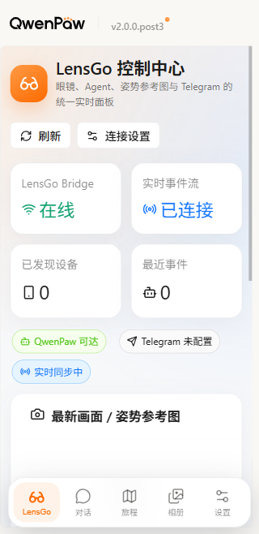

# LensGo × QwenPaw 统一 App 项目报告

报告日期：2026-07-23

## 项目现在是什么

现在它是一套“同一界面、两个后端模块、多个终端”的智能眼镜旅行助理：

- **LensGo 模块**负责接入眼镜、媒体上传、实时事件、记忆和 Telegram；
- **QwenPaw 模块**负责大模型、Agent、Skill、对话、旅行规划、相册和原有可视化控制台；
- **统一 App**把两边组合到同一个响应式界面中，在电脑、浏览器和后续三星 Android 手机上使用。

两个原仓库没有被合并成难以维护的一团，也没有删除任何原功能。它们仍是独立 Git 仓库，外层 `Qwen_competion` 负责统一配置、启动、测试和工作区。

## App 长什么样

手机首页不再只是 QwenPaw 页面，而是新的 LensGo 控制中心：

- 顶部显示 LensGo Bridge 是否在线、实时事件流是否连接；
- 显示发现的眼镜设备数和最近事件数；
- 显示 QwenPaw、Telegram 和实时同步状态；
- 眼镜上传图片或 Pose Coach 生成图片后，最新图片会出现在主面板；
- 底部固定五个入口：LensGo、对话、旅程、相册、设置。



电脑端仍保留原 QwenPaw 侧边栏和完整管理能力；手机端自动切换成更适合单手使用的底部导航。

## 为什么 Android 不直接运行 Python

三星手机上的 App 是一个独立安装的 Tauri Android 客户端，但模型和 Python 服务继续运行在电脑或云服务器。这是刻意选择的产品架构：

```text
三星手机 App
   │ HTTPS / WSS
   ▼
电脑或云服务器
   ├─ QwenPaw：模型、Agent、对话、旅行规划
   ├─ LensGo：眼镜、事件、媒体
   └─ Telegram / 图片生成服务
```

这样做的好处是：手机安装包更轻、Agent 可以在服务器升级、图片模型密钥不会进入 APK，也不会受到 Android 对 Python 依赖和后台进程的限制。

## 姿势功能如何工作

当你对眼镜、Telegram 或 App 说“我在某个景点应该摆什么姿势，并生成参考图”时：

1. Travel Director 理解地点、人物、镜头和氛围；
2. Pose Coach 给出身体动作、手部、视线、机位和安全提示；
3. 图片工具调用配置好的生图模型；
4. 生成图回到当前 QwenPaw 会话；
5. LensGo Bridge 把同一媒体事件送到控制中心；
6. Telegram Mirror 把图片发送到 Telegram。

如果生图或 Telegram 暂时失败，系统仍返回文字姿势建议，不影响眼镜的文字/TTS 和其他原功能。

## 已完成内容

- 新增 LensGo 控制中心；
- 新增移动端五栏导航和响应式布局；
- 新增 Android 首次连接页；
- 新增 QwenPaw/LensGo 动态服务器地址；
- 新增带 Token 的 LensGo 状态、事件、媒体和 WebSocket 接入；
- 新增 Tauri Android 配置、移动能力权限和构建脚本；
- 保留桌面 App、Web、对话、旅行规划、相册、设置和既有 Agent；
- 完成桌面构建、移动构建、全量前端测试、LensGo 测试和手机尺寸浏览器联调。

## 当前验证结果

| 验证项目 | 结果 |
|---|---:|
| 前端全量测试 | 1162 passed |
| LensGo 测试 | 42 passed |
| 外层集成测试 | 8 passed，24 subtests |
| 桌面 Web 构建 | 通过 |
| Android 前端构建 | 通过 |
| 环境 Doctor | 0 errors |
| Galaxy S9+ 规格真实浏览器联调 | 通过 |

旅行相册目前提示 AI Drive 不可用，是因为外部 AI Drive 地址尚未配置；真实模型回答、Pose 生图和 Telegram 发图也需要用户自己的密钥与 Bot 信息。

## 离三星手机安装还差什么

代码和移动前端已经准备好，但当前电脑缺少 Android Studio/SDK、JDK 17、Rust/Cargo 和 Android Rust targets，所以目前没有生成 APK。安装这些官方工具后运行：

```powershell
cd C:\Users\zhang\Desktop\Project\Qwen_competion
.\scripts\build_android.ps1 -Initialize -DebugBuild
```

然后把 Debug APK 安装到三星手机，用电脑的局域网 IP 连接；不能在手机中填写 `127.0.0.1`。

Android 9 及以上默认限制发行包的明文 HTTP。正式版本应使用 HTTPS/WSS；仅局域网 Debug 时才可在生成的 Debug Manifest 临时允许 cleartext traffic。

正式上线前还必须配置 HTTPS/WSS、QwenPaw 登录、Bridge 强 Token、反向代理和 Android 签名。

## 下一步建议

下一轮最合适的任务是“安装 Android 工具链并在三星真机上生成、安装和联调 Debug APK”。随后再填入真实模型、图片模型和 Telegram 凭证，完成从语音提问到 App/Telegram 收图的端到端验收。
