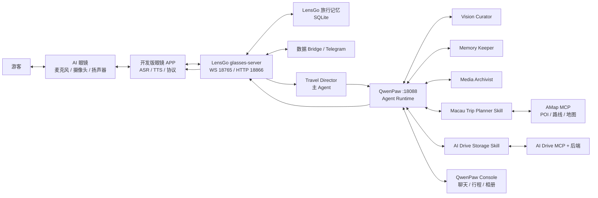

# LensGo × QwenPaw 澳门旅行智能眼镜完整项目报告

> **历史阶段报告。** 本文保留 2026-07-23 早期一体化分析，后续章节中
> “环境尚未部署”“尚未生成 APK”等结论已经过时。2026-07-24 的当前真实状态、
> Android 真机构建、眼镜联调和 NLS 阻塞请以 `项目详细说明.md` 与
> `HANDOFF.md` 为准。请勿依据本文旧状态重复安装或覆盖现有工作区。

报告日期：2026-07-23  
项目位置：`C:\Users\zhang\Desktop\Project\Qwen_competion`  
项目阶段：代码与工程结构已完成一体化，运行环境与外部服务尚未部署

---

## 1. 执行摘要

本项目是一套面向澳门旅游场景的 AI 智能眼镜与多 Agent 旅行助手系统。它把现实世界中的语音、图片和视频输入，通过 LensGo 眼镜接入服务送入 QwenPaw Agent 平台，再由主 Agent、视觉 Agent、记忆 Agent、媒体归档 Agent 以及澳门行程规划和 AI Drive 工具共同处理，最终把简短、自然、适合语音播报的回答返回眼镜。

整个项目由两个原始模块组成：

| 模块 | 产品层次 | 主要职责 |
|---|---|---|
| `lensgo-macao` | 设备与场景接入层 | 眼镜协议、WebSocket、图片/视频上传、TTS 分片、旅行记忆、数据 Bridge、Telegram |
| `qwen_compitition` | Agent 平台与业务工作台 | QwenPaw 运行时、多 Agent、模型、Skills、MCP/Driver、长期记忆、澳门行程规划、旅行相册 |

两个模块已经通过一个无损的外层工程整合为统一项目：

- 保留两个原仓库、Git 历史、源码和原启动方式；
- 不删除、不移动、不重写既有功能；
- 新增统一配置、统一工作区、统一初始化、统一启动和统一测试入口；
- 统一 QwenPaw 端口、LensGo 端口、Agent 工作区和行程数据目录；
- 自动装配四个 LensGo Agent、澳门行程 Skill、AI Drive Skill，以及可选的 AMap/AI Drive Driver；
- 对同名配置采用“缺失才新增、冲突保留原文件”的策略。

当前可以准确描述为：

> 项目源码和工程边界已经整理成一个完整的一体化项目，但尚未安装全部依赖、构建前端、配置模型密钥，也尚未接入仓库外的 AMap MCP、AI Drive MCP、AI Drive 后端和官方眼镜 APP，因此目前不是已经运行的生产系统。

---

## 2. 产品目标与用户体验

项目希望把传统的“打开手机、输入问题、查看页面”旅行体验，转换为更自然的第一视角陪伴体验。

用户通过眼镜可以完成：

- 询问眼前是什么建筑、景点或物体；
- 拍摄图片，让系统讲解场景、给出拍照建议；
- 上传短视频，让系统理解旅途中正在发生的事件；
- 规划澳门一日游或多日游；
- 获得真实 POI、路线、交通时间和分日行程；
- 保存旅途照片并形成旅行相册；
- 在后续交互中复用个人旅行记忆；
- 通过 Telegram 查看 LensGo 的交互镜像或工作状态。

系统的关键交互原则是：

1. 眼镜回答必须短、自然、适合 TTS 播放。
2. 专业 Agent 在后台协作，不直接把冗长分析暴露给用户。
3. 行程生成前先收集信息并让用户确认。
4. 图片、视频和个人旅行记录按用户隔离。
5. QwenPaw 负责分析与决策，外部服务只提供地图或存储能力。

---

## 3. 总体系统架构



系统可以分为六层：

| 层次 | 组成 | 作用 |
|---|---|---|
| 设备层 | AI 眼镜 | 采集语音/图像/视频，播放语音 |
| APP 协议层 | 官方开发版 APP | ASR、TTS、协议封装、网络传输 |
| 接入层 | LensGo glasses-server | 鉴权、协议解析、媒体落盘、会话管理 |
| 编排层 | LensGo Router + Travel Director | 用户上下文注入、任务判断、多 Agent 协作 |
| Agent 与工具层 | QwenPaw、Skills、Drivers、MCP | 模型推理、记忆、行程规划、外部工具调用 |
| 可视化与存储层 | Console、TravelPlanner、TravelAlbum、AI Drive | 网页交互、地图展示、照片管理 |

LensGo 与 QwenPaw 之间采用 HTTP/SSE 边界，不进行 Python 包内的紧耦合调用。这使两个模块仍能单独开发和测试。

---

## 4. 一体化项目目录

```text
Qwen_competion/
├─ lensgo-macao/                    # 原 LensGo 仓库
│  ├─ ai_glasses_debug/             # 当前眼镜主服务
│  ├─ gateway/                      # 旧 FastAPI Gateway
│  ├─ qwenpaw_agents/               # 四个 Agent 的 Prompt
│  ├─ run_all.sh
│  ├─ run_qwenpaw.sh
│  └─ 项目原始说明
│
├─ qwen_compitition/                # 原 QwenPaw 仓库
│  ├─ src/qwenpaw/                  # Python 后端与 Agent Runtime
│  ├─ console/                      # React/Vite 控制台
│  ├─ working/workspaces/default/   # 澳门 Skill 与 Driver 模板
│  └─ tests/
│
├─ config/
│  └─ lensgo.integrated.toml        # 一体化 LensGo 配置
├─ docs/
│  ├─ ARCHITECTURE.md
│  ├─ OPERATIONS.md
│  ├─ REFACTOR_REPORT.md
│  └─ 完整项目报告.md
├─ scripts/
│  ├─ integrated.py                 # doctor/bootstrap/start/test
│  ├─ bootstrap.ps1
│  ├─ bootstrap.sh
│  ├─ start.ps1
│  └─ start.sh
├─ tests/
│  └─ test_integrated_layout.py
├─ workspace/                       # 统一运行数据
├─ .env.integrated.example
├─ .gitignore
├─ README.md
└─ 项目模块理解与集成说明.md
```

这里的“一体化”不是把两个仓库强制合并为一个源码仓库，而是在它们外部建立统一工程门面。这种设计有三个好处：

1. 保留每个模块的来源和 Git 历史。
2. 避免复制代码造成两套实现逐渐分叉。
3. 可以随时回到两个模块原有的独立运行方式。

---

## 5. LensGo 模块详解

### 5.1 模块定位

`lensgo-macao` 是设备接入和场景编排模块。它理解眼镜 APP 的协议，把文字、图片、视频转成 QwenPaw 能处理的请求，并把 QwenPaw 的流式回答转换为眼镜可播放的下行消息。

当前主服务入口：

```text
lensgo-macao/ai_glasses_debug/glasses/server/app.py
```

主要子组件：

| 文件/目录 | 职责 |
|---|---|
| `glasses/server/ws_handler.py` | WebSocket 会话、协议消息、文字/图片主流程 |
| `glasses/server/http_routes.py` | 视频和媒体 HTTP 上传 |
| `glasses/server/qwenpaw_bridge.py` | 调用 QwenPaw、处理 SSE、停止旧任务 |
| `glasses/server/tts_chunker.py` | 将流式回答切成适合 TTS 的短句 |
| `glasses/server/lensgo_memory.py` | SQLite 旅行者与观察记录 |
| `glasses/server/data_bridge.py` | 事件历史、实时订阅、媒体访问 |
| `glasses/server/telegram_bridge.py` | Telegram 镜像与消息收发 |
| `glasses/common/protocol.py` | 眼镜上下行协议结构 |
| `config.toml` | 原模块配置 |

### 5.2 眼镜通信协议

眼镜 APP 连接：

```text
ws://<host>:18765/chat
```

请求 Header：

- `access_token`
- `device_id`

上行消息使用 `CSChatWordImage`，通过 `askType` 表达模态：

| askType | 输入类型 | 传输方式 |
|---:|---|---|
| 1 | 文字 | WebSocket JSON |
| 2 | 主动图片 | WebSocket Base64/Data URL |
| 3 | 意图触发图片 | WebSocket Base64/Data URL |
| 4 | 视频 | WebSocket 通知 + HTTP multipart |

主要下行消息：

| 消息 | 作用 |
|---|---|
| `SCChat` | 文本回答，可多段流式返回 |
| `SCIntentMessage` | 要求 APP 拍照等 |
| `SCFinishAIMessage` | 结束当前 AI 会话 |
| `SCError` | 返回协议或服务错误 |

### 5.3 会话和并发

LensGo 以 `(user_id, device_id)` 为设备会话键，维护：

- 当前 WebSocket；
- QwenPaw session/chat ID；
- SSE 任务；
- WebSocket 写锁；
- 当前是否处于流式回答状态。

如果同一设备在旧回答尚未结束时发起新问题，服务会先停止 QwenPaw 旧任务，再取消旧的本地 Task，避免两个答案同时进入眼镜。

### 5.4 TTS 分片

QwenPaw 返回的是 SSE 增量文本。LensGo 的 `TtsChunker` 会根据：

- 句号等自然语句边界；
- 换行；
- 最大长度；
- 最终结束信号；

把文本拆成多个 `SCChat`。只有最后一段设置 `isEnd=true`。这样眼镜可以边生成边播放，而不必等待整个回答完成。

### 5.5 图片与视频

图片流程：

1. 接收 Base64/Data URL；
2. 解码并按用户目录保存；
3. 上传到 QwenPaw 文件接口；
4. 构造文本块和图片块；
5. 由主 Agent 判断是否调用视觉专家；
6. 流式返回简短场景讲解或拍照建议。

视频流程：

1. APP 通过 HTTP 上传视频；
2. LensGo 落盘并上传 QwenPaw；
3. 使用固定视频分析提示词；
4. 在后台异步处理；
5. 通过原 WebSocket 将结果回推眼镜。

### 5.6 LensGo 共享旅行记忆

一体化运行时数据库：

```text
workspace/runtime/data/lensgo_memory.db
```

表结构：

| 表 | 用途 |
|---|---|
| `travelers` | 旅行者 ID、原 user ID、显示名、偏好 |
| `observations` | 每次请求的来源、模态、文本、媒体和时间 |
| `moments` | 重要时刻候选、重要度、媒体引用 |

系统不会直接把原始 `userId` 当作姓名，而是计算：

```text
traveler_<SHA-256(user_id) 前 16 位>
```

当前已实现：

- 创建稳定的伪匿名 `traveler_id`；
- 保存 observation；
- 为新请求注入最近五条同用户记录；
- 在眼镜和 Telegram 入口之间共享该上下文。

当前尚未完全实现：

- `preferences` 的动态维护；
- `moments` 的完整写入和生命周期；
- 自动媒体过期清理；
- LensGo SQLite 与 QwenPaw ReMe 的统一记忆模型。

### 5.7 Bridge 与 Telegram

Bridge 接口：

```text
GET /api/bridge/events
WS  /api/bridge/ws
GET /api/bridge/media/{user_id}/{filename}
```

功能：

- 保存最近 200 条事件；
- 向多个订阅者实时广播；
- 提供受 Bearer Token 保护的历史和媒体接口；
- 公开眼镜上行、Agent 下行、设备状态和错误。

Telegram 有两个角色：

- 大使 Bot：接收文字/图片，复用在线眼镜的 Agent 会话；
- 状态 Bot：只展示设备、Router、Agent 协作和错误状态。

### 5.8 旧 Gateway

`lensgo-macao/gateway/app.py` 是较早的 FastAPI Gateway，提供：

- 图片上传；
- 简单 WebSocket；
- 健康检查。

它没有接入当前官方 APP 协议、多 Agent 和共享旅行记忆。一体化工程保留了该功能，但默认不启动，因为它和外部 AI Drive 后端都可能使用 8000 端口。

---

## 6. QwenPaw 模块详解

### 6.1 模块定位

`qwen_compitition` 是 QwenPaw `2.0.0.post3` 的完整源码，并包含澳门旅行和 AI Drive 定制。

技术栈：

- Python 3.11–3.13；
- FastAPI、Uvicorn；
- AgentScope 2.0；
- ReMe 长期记忆；
- MCP/Driver 工具体系；
- React 18、TypeScript、Vite；
- Ant Design、Leaflet。

启动链：

```text
qwenpaw app
  → qwenpaw.cli.app_cmd
  → uvicorn
  → qwenpaw.app._app:app
```

### 6.2 Agent 运行过程

一次请求的主要生命周期：

1. 根据 `X-Agent-Id` 确定目标 Agent；
2. 从 Agent 工作区读取配置和 Prompt；
3. 加载启用的 Skills、Drivers 和审批策略；
4. 装配模型、Toolkit、记忆和中间件；
5. 创建请求级 Agent Runtime；
6. 执行推理和工具调用；
7. 通过 SSE 返回增量结果；
8. 保存会话历史、Scroll 和 ReMe；
9. 在取消或异常路径中尽力保存状态。

系统 Prompt 由多部分组合：

- Agent 身份；
- `AGENTS.md`；
- `SOUL.md`；
- `PROFILE.md`；
- 环境上下文；
- Skill 指令；
- Driver 能力说明；
- ReMe 记忆指引。

### 6.3 Skills 与 Drivers

两者职责不同：

| 类型 | 作用 |
|---|---|
| Skill | 告诉 Agent 什么时候触发、询问什么、按什么业务流程处理 |
| Driver/MCP | 提供真实工具，例如地图搜索、路线规划、文件归档 |

Driver 支持：

- stdio MCP 子进程；
- HTTP 类连接；
- 环境变量和凭据引用；
- 工具列表缓存；
- allow / deny / ask 审批策略；
- 按 Agent 工作区隔离配置。

### 6.4 QwenPaw 记忆

QwenPaw 提供：

- Scroll/对话历史：保存完整会话；
- ReMe Light：提取和检索长期语义记忆；
- Agent 独立工作区：每个 Agent 拥有自己的 Prompt、Skill、Driver 和记忆。

它与 LensGo 记忆的分工：

| 记忆 | 范围 |
|---|---|
| LensGo SQLite | 入口级、旅行者级、跨眼镜与 Telegram |
| QwenPaw Scroll | 单会话完整历史 |
| QwenPaw ReMe | 单 Agent 长期语义记忆 |

---

## 7. 四个 LensGo Agent

| Agent ID | 定位 | 主要职责 |
|---|---|---|
| `lensgo-travel-director` | 主 Agent | 面向用户、识别意图、组织回答、调用其他 Agent |
| `lensgo-vision-curator` | 视觉专家 | 场景理解、光线构图、安全提醒、纪念价值 |
| `lensgo-memory-keeper` | 记忆专家 | 用户偏好、旅程事实、同行关系、重要时刻候选 |
| `lensgo-media-archivist` | 媒体专家 | 去重、归属、隐私、保留期限、删除和归档建议 |

主 Agent 的输出要求：

- 默认 1–3 句；
- 通常不超过 120 字；
- 适合眼镜朗读；
- 不向用户暴露内部 Agent 协作过程；
- 不把技术错误堆栈或工具细节直接播报。

多 Agent 协作逻辑：

1. Travel Director 接受统一请求。
2. 如果是视觉问题，调用 Vision Curator。
3. 如果涉及偏好或旅程回忆，调用 Memory Keeper。
4. 如果涉及媒体保存、删除或隐私，调用 Media Archivist。
5. 主 Agent 汇总内部结果，生成最终短回答。

---

## 8. 澳门旅行规划

### 8.1 澳门行程 Skill

Skill：

```text
qwen_compitition/working/workspaces/default/skills/macau_trip_planner/
```

一体化 bootstrap 会把它安装到：

- `default` Agent；
- `lensgo-travel-director` Agent。

业务流程：

1. 收集天数、酒店/起点、同行人、步行能力、兴趣、预算和交通偏好；
2. 每轮最多询问两个问题；
3. 信息足够后展示行程确认；
4. 用户确认后才调用地图工具；
5. 搜索真实 POI；
6. 每天最多安排 10 个地点；
7. 构建分日路线；
8. 保留真实距离、到达时间、离开时间和交通时间；
9. 生成每日地图；
10. 用户修改一天时，只重排受影响日期。

### 8.2 AMap MCP

预期能力：

- `amap_search_poi`
- `amap_plan_route`
- `amap_render_route_map`
- `amap_build_itinerary`

输出目录被统一到：

```text
workspace/qwenpaw/workspaces/default/media/travel_maps/
```

这样无论行程由主 Agent 还是 default Agent 生成，TravelPlanner 页面都会读取同一个：

```text
latest-itinerary.json
```

需要注意：

- AMap MCP 源码不在当前两个仓库中；
- 需要高德 Web 服务 Key；
- `amap_build_itinerary` 在原策略下可能触发用户审批；
- 不应为了自动化把整个 Driver 设成无条件放行。

### 8.3 TravelPlanner 后端

主要接口：

| 接口 | 功能 |
|---|---|
| `GET /travel-planner/latest` | 获取最新结构化行程 |
| `GET /travel-planner/route` | 获取真实道路折线 |
| `GET /travel-planner/album/photos` | 获取旅行照片 |
| `GET /travel-planner/album/photos/{id}/image` | 代理图片 |
| `POST /travel-planner/album/photos` | 上传旅行照片 |
| `DELETE /travel-planner/album/photos/{id}` | 软删除照片 |

路线结果会缓存到：

```text
workspace/qwenpaw/workspaces/default/media/travel_maps/route-cache.json
```

### 8.4 TravelPlanner 前端

主要功能：

- 按天切换行程；
- 每 20 秒刷新最新行程；
- Leaflet 地图；
- 高德 GCJ-02 瓦片；
- 真实道路折线；
- 路线不可用时显示虚线降级；
- 编号 Marker 与活动时间线联动；
- 展示停留时间、交通方式、距离和在途时间。

---

## 9. AI Drive 与旅行相册

### 9.1 AI Drive Skill

Skill：

```text
qwen_compitition/working/workspaces/default/skills/qwenpaw_ai_drive_storage/
```

设计原则：

> QwenPaw 负责分析、分类、摘要和标签，AI Drive 只负责持久化和可视化。

处理附件时：

1. QwenPaw 使用自己的文件工具读取内容；
2. 生成分类、路径、摘要、标签和关键点；
3. 调用一次 `ai_drive_store_from_qwenpaw`；
4. 返回最终归档位置。

这避免 QwenPaw 和 AI Drive 分别做两次 AI 分析，减少重复计算和结论冲突。

### 9.2 TravelAlbum

前端能力：

- 按 EXIF 拍摄时间排序；
- 无 EXIF 时使用上传时间；
- 按日期分组；
- 展示相机信息、GPS、摘要和标签；
- 支持多图上传；
- 删除进入 AI Drive 回收站；
- 图片由 QwenPaw 后端代理。

### 9.3 外部依赖

以下内容不在当前仓库：

- `ai-drive-mcp/server.py`；
- AI Drive 后端；
- AI Drive 的持久化数据库和文件存储。

默认后端地址为：

```text
http://127.0.0.1:8000
```

---

## 10. 端到端数据流

### 10.1 文字问答

```text
用户说话
→ APP 完成 ASR
→ WebSocket askType=1
→ LensGo 鉴权并解析 userId
→ 写入 observation
→ 注入 traveler_id + 最近五条旅行记录
→ 请求 lensgo-travel-director
→ QwenPaw 推理/调用专家
→ SSE 流式回答
→ TtsChunker 切分 SCChat
→ APP TTS
→ 眼镜播放
```

### 10.2 图片识别

```text
眼镜拍照
→ APP 发送 Base64 图片
→ LensGo 解码、校验、保存
→ 上传 QwenPaw 文件接口
→ 主 Agent + Vision Curator
→ 返回地点故事/拍照建议/安全提醒
→ 眼镜播报
```

### 10.3 视频理解

```text
APP 通过 HTTP 上传视频
→ LensGo 保存并上传 QwenPaw
→ 后台多模态分析
→ 结果通过原 WebSocket 回推
→ 眼镜播报
```

### 10.4 行程规划

```text
用户提出澳门旅行需求
→ Trip Planner Skill 分轮收集条件
→ 用户确认
→ AMap MCP 搜索 POI 和路线
→ 生成 latest-itinerary.json + 地图
→ TravelPlanner 页面展示
→ 主 Agent 返回适合眼镜播报的摘要
```

### 10.5 照片归档

```text
用户上传照片
→ QwenPaw 读取与分析
→ 生成分类/路径/摘要/标签
→ AI Drive MCP 持久化
→ TravelAlbum 按日期展示
→ 删除时进入回收站
```

---

## 11. 统一配置与运行数据

### 11.1 端口

| 服务 | 地址/端口 |
|---|---|
| QwenPaw | `http://127.0.0.1:18088` |
| LensGo WebSocket | `ws://127.0.0.1:18765/chat` |
| LensGo HTTP/Bridge | `http://127.0.0.1:18866` |
| AI Drive 后端 | 默认 `http://127.0.0.1:8000` |
| 旧 Gateway | 原默认 8000，不自动启动 |

### 11.2 统一工作区

| 数据 | 目录 |
|---|---|
| QwenPaw 配置/会话/Agent | `workspace/qwenpaw/` |
| Agent 工作区 | `workspace/qwenpaw/workspaces/<agent-id>/` |
| 行程与地图 | `workspace/qwenpaw/workspaces/default/media/travel_maps/` |
| QwenPaw 媒体 | `workspace/qwenpaw/workspaces/default/media/` |
| LensGo 媒体 | `workspace/runtime/lensgo-media/` |
| LensGo SQLite | `workspace/runtime/data/lensgo_memory.db` |
| 日志 | `workspace/logs/` |

### 11.3 环境配置

模板：

```text
.env.integrated.example
```

主要变量：

| 变量 | 作用 |
|---|---|
| `QWENPAW_HOST` / `QWENPAW_PORT` | QwenPaw 地址 |
| `QWENPAW_AGENT_ID` | LensGo 主 Agent |
| `QWENPAW_PROVIDER_ID` / `QWENPAW_MODEL_ID` | 模型配置 |
| `GLASSES_BRIDGE_TOKEN` | Bridge Bearer Token |
| `TELEGRAM_*` | 两个 Telegram Bot |
| `AMAP_MCP_SERVER` | AMap MCP 脚本路径 |
| `AMAP_CONFIG_FILE` | 高德 MCP 环境配置 |
| `AI_DRIVE_MCP_SERVER` | AI Drive MCP 脚本路径 |
| `AI_DRIVE_BASE_URL` | AI Drive 后端地址 |

真正的 `.env.integrated` 已被 `.gitignore` 排除，密钥不应提交到 Git。

---

## 12. 一体化编排器

统一入口：

```text
scripts/integrated.py
```

### 12.1 doctor

```powershell
python .\scripts\integrated.py doctor
```

检查：

- Python 版本；
- 两个模块是否完整；
- 一体化 TOML；
- `.env.integrated`；
- `.venv`；
- QwenPaw 工作区；
- AMap/AI Drive 外部路径；
- 端口占用；
- Git、npm。

### 12.2 bootstrap

```powershell
.\scripts\bootstrap.ps1
```

执行：

1. 创建外层 `.venv`；
2. editable 安装 QwenPaw 和 LensGo；
3. 安装旧 Gateway 需要的 FastAPI/Uvicorn/multipart；
4. 初始化统一 QwenPaw 工作区；
5. 默认退出匿名遥测；
6. 创建四个 Agent；
7. 为新 Agent 安装 LensGo Prompt；
8. 合并澳门行程和 AI Drive Skill；
9. 根据环境变量生成可用 Driver；
10. 保留任何已存在的用户配置。

### 12.3 start

```powershell
.\scripts\start.ps1
```

统一启动：

- QwenPaw 18088；
- LensGo 18765/18866。

按 `Ctrl+C` 会停止本次启动器创建的两个进程。不会终止用户在其他终端启动的服务。

也可分别启动：

```powershell
python .\scripts\integrated.py start --qwen-only
python .\scripts\integrated.py start --glasses-only
```

### 12.4 test

```powershell
python .\scripts\integrated.py test
```

完整模式会尝试运行：

- 外层一体化测试；
- LensGo 测试；
- QwenPaw 测试。

只验证结构：

```powershell
python .\scripts\integrated.py test --layout-only
```

---

## 13. 当前验证结果

本次已经执行：

| 验证 | 结果 |
|---|---|
| 一体化布局测试 | 6/6 通过 |
| 环境诊断 | 0 个错误 |
| Python | 3.13.5，满足 3.11–3.13 |
| QwenPaw 18088 | 验证时可用 |
| LensGo WS 18765 | 验证时可用 |
| LensGo HTTP 18866 | 验证时可用 |
| `lensgo-macao` Git 状态 | 干净 |
| `qwen_compitition` Git 状态 | 干净 |

外层测试覆盖：

- 两个原模块关键入口存在；
- 四个 Agent Prompt 完整；
- 两个定制 Skill 完整；
- 统一端口与 Agent ID 一致；
- 运行数据位于外层 workspace；
- Python 版本满足要求。

尚未执行：

- 创建 `.venv` 和安装全部依赖；
- QwenPaw 初始化；
- 四个 Agent 的真实运行时创建；
- React 控制台构建；
- LensGo 11 个测试文件；
- QwenPaw 294 个测试文件；
- 实际服务启动与接口联调；
- 官方眼镜 APP 联调；
- AMap/AI Drive/Telegram 端到端验证。

---

## 14. 安全与隐私评估

### 14.1 当前主要风险

1. LensGo JWT 只解码 payload，没有验签。
2. 当前未检查 JWT `exp`。
3. LensGo 默认 Token 策略为 `allow_any`。
4. 服务默认可监听 `0.0.0.0`。
5. Bridge 事件仍可能包含原始 `user_id`。
6. 图片和视频尚无自动过期清理。
7. 公网部署文档中存在 `ws/http` 示例。
8. Telegram、地图和模型 Token 均属于高敏感凭据。

### 14.2 生产前必须完成

- 在可信网关或 LensGo 内实现 JWT 验签和过期校验；
- 使用 `wss/https`；
- 配置防火墙或反向代理；
- 把 Token 放入本机凭据存储或环境变量；
- 对 Bridge 输出使用 `traveler_id` 或进一步脱敏；
- 实现媒体保留期限和自动删除；
- 对 Agent 工具采用最小权限规则；
- 对删除、公开分享和高风险工具保留审批；
- 制定旅行照片、GPS 和用户记忆的隐私策略。

---

## 15. 已知限制与技术债务

| 项目 | 当前情况 | 影响 |
|---|---|---|
| AMap MCP | 不在仓库 | 行程无法生成真实 POI/路线 |
| AI Drive MCP/后端 | 不在仓库 | 相册无法真实存储 |
| 模型 Provider | 未配置 | Agent 不能推理 |
| Console 构建 | 尚未执行 | Web 页面可能无法从源码包直接访问 |
| 官方眼镜 APP | 外部依赖 | 不能完成真机链路 |
| LensGo preferences | 固定空对象 | 个性化能力有限 |
| LensGo moments | 只有表结构 | 重要时刻尚未形成完整闭环 |
| 双记忆系统 | SQLite 与 ReMe 分离 | 记忆一致性需要设计 |
| Travel 自定义测试 | 未发现专门测试 | 行程与相册回归风险较高 |
| 旧 Gateway 端口 | 与 AI Drive 同为 8000 | 不能默认同时运行 |
| Linux 绝对路径 | 原 Driver 中存在 | Windows 不能直接复用原卡片 |

一体化脚本已经解决：

- QwenPaw 工作目录不统一；
- 主 Agent 缺少旅行/AI Drive Skill；
- 18088/8088/8092 端口不一致；
- 原 Driver 的固定 Linux 路径；
- 行程输出与 TravelPlanner 读取路径不一致；
- 两个进程缺少统一生命周期入口。

---

## 16. 推荐部署顺序

### 第一阶段：本机基础运行

1. 复制 `.env.integrated.example` 为 `.env.integrated`。
2. 配置可用的 QwenPaw Provider 和模型。
3. 执行 `doctor`。
4. 执行 `bootstrap`。
5. 构建 Console。
6. 只启动 QwenPaw，验证网页和 Agent。
7. 再启动 LensGo，验证文字 SSE 和 TTS 分片。

### 第二阶段：多模态与多 Agent

1. 验证 `lensgo-travel-director` 被正确选中。
2. 验证三个专家 Agent 可调用。
3. 验证图片上传和视觉回答。
4. 验证视频异步回推。
5. 验证 LensGoContext 和共享旅行记忆。
6. 验证 Telegram 与眼镜共享会话。

### 第三阶段：澳门行程

1. 获取并部署 AMap MCP。
2. 配置高德 Key。
3. 验证 POI、路线和地图。
4. 验证确认前不生成最终行程。
5. 验证 `latest-itinerary.json`。
6. 验证 TravelPlanner 地图、时间线和缓存。

### 第四阶段：旅行相册

1. 部署 AI Drive 后端。
2. 部署 AI Drive MCP。
3. 验证单图和多图上传。
4. 验证摘要、标签和分类。
5. 验证 TravelAlbum 时间线。
6. 验证软删除和回收站。

### 第五阶段：安全与真机

1. 补齐 JWT 验签。
2. 启用 TLS。
3. 配置公网反向代理或 FRP。
4. 接入官方眼镜 APP。
5. 完成弱网、断线重连和并发测试。
6. 制定媒体和记忆保留政策。

---

## 17. 建议验收标准

项目达到“完整比赛演示可用”至少应满足：

- [ ] QwenPaw 控制台正常打开。
- [ ] 四个 LensGo Agent 创建成功。
- [ ] 主 Agent 可调用三个专家。
- [ ] 文字请求能在眼镜端流式播报。
- [ ] 新问题能正确停止旧回答。
- [ ] 图片和视频均可完成多模态分析。
- [ ] 同一用户在眼镜和 Telegram 中共享 LensGoContext。
- [ ] 不同用户的数据和媒体相互隔离。
- [ ] 澳门行程在确认后才生成。
- [ ] 高德返回真实 POI、路线和地图。
- [ ] TravelPlanner 能显示最新行程。
- [ ] AI Drive 能保存和软删除照片。
- [ ] TravelAlbum 能按日期展示照片。
- [ ] 所有凭据未进入 Git。
- [ ] 公网请求经过 TLS 和真实 JWT 验签。
- [ ] 媒体具有自动清理策略。
- [ ] 关键自定义业务具备自动化测试。

---

## 18. 项目评价

### 优点

- 设备接入、Agent 平台和业务工作台职责分层清晰；
- 使用 HTTP/SSE 连接，模块耦合较低；
- 已具备文字、图片、视频三种模态；
- 多 Agent 职责具有明确业务边界；
- 同时拥有轻量共享记忆和 Agent 长期记忆；
- 澳门行程规划流程约束详细，不是简单的一次性 Prompt；
- AI Drive 坚持“QwenPaw 分析、Drive 存储”的合理边界；
- 一体化重构保留了两个原仓库的完整性。

### 主要挑战

- 完整演示依赖多个仓库外服务；
- 安全验证目前只适合本地联调；
- Windows 与原 Linux 路径存在环境差异；
- 自定义行程和相册测试不足；
- 双记忆体系需要长期一致性策略；
- 真机、弱网和公网条件下仍需要系统性验证。

### 综合判断

这是一个架构方向完整、场景表达清晰的比赛型项目，已经具备“智能眼镜入口 + 多 Agent 旅行助手 + 地图规划 + 旅行相册”的完整产品骨架。一体化整理解决了原先两个模块工作区、端口、Skill 和 Driver 无法直接接通的问题。

当前最需要的不是继续重写已有业务，而是补齐外部依赖、执行 bootstrap、构建前端，并按验收清单逐层联调。完成这些工作后，项目才能从“完整代码工程”进入“可运行演示系统”，再进一步补齐安全和测试后才适合生产部署。
