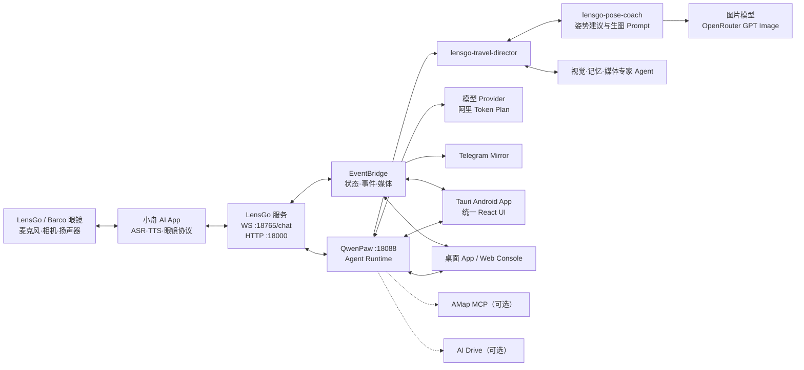

# LensGo × QwenPaw 澳门旅行智能眼镜一体化项目详细说明

文档版本：2026-07-24  
项目目录：`C:\Users\zhang\Desktop\Project\Qwen_competion`  
适用对象：项目维护者、后续开发模型、Android 开发者、比赛演示人员和部署人员

## 1. 项目概述

本项目把两个原本独立的仓库组合为一套澳门旅行智能眼镜系统：

- `lensgo-macao` 负责接入眼镜和小舟 AI App，处理 WebSocket/HTTP 协议、图片与视频、TTS 回传、旅行记忆、实时事件和 Telegram 镜像。
- `qwen_compitition` 负责 QwenPaw Agent 运行时、大模型 Provider、Skills、MCP/Driver、长期记忆、旅行规划、相册和可视化 Console。
- 外层 `Qwen_competion` 负责统一环境变量、工作区、启动、测试、桌面 App 和 Android 构建。

整合采用“保留原模块、增加连接层”的方式。两个子仓库仍有自己的 Git 历史和原始入口，没有删除原页面、Agent、协议、测试或业务逻辑。新增代码主要负责把设备层、Agent 层、可视化层和移动端连接起来。

一句话描述：

> 用户通过眼镜、Android App 或 Telegram 与旅行 Agent 交互；Agent 理解文字、照片和旅行上下文，能规划澳门行程、给出拍照姿势、生成参考图，并将结果同步到眼镜 TTS、统一可视化面板和 Telegram。

## 2. 产品形态

系统有四类终端：

1. **LensGo/Barco 眼镜**：采集麦克风、相机和设备数据，播放回答语音。
2. **小舟 AI 眼镜 App**：眼镜的官方/配套 Android 接入程序，承担蓝牙设备管理、ASR、TTS 和项目 WebSocket/HTTP 协议。
3. **LensGo 澳门旅行助手 App**：本项目新增的独立 Tauri Android App，包名为 `io.lensgo.macao.mobile`，显示统一可视化界面。
4. **桌面/Web/Telegram**：电脑端完整控制台、兼容桌面窗口和两个 Telegram Bot。

Android App 不是在手机里运行 Python 或模型。它是远程客户端，核心服务继续运行在电脑或云服务器。这能避免把 Python、Agent、模型密钥和媒体后端塞进 Android，同时允许服务器升级 Agent 而不用频繁更新 APK。

## 3. 总体架构



### 3.1 服务端口

| 端口 | 服务 | 用途 |
|---:|---|---|
| `18088` | QwenPaw | Console、Agent API、SSE、统一 Web 前端 |
| `18765` | LensGo WebSocket | 小舟 AI App `/chat` 长连接 |
| `18000` | LensGo HTTP / Bridge | 视频/媒体上传、Bridge 状态、事件、媒体与 WebSocket |
| `8000` | 外部 AI Drive 或旧 Gateway | 不纳入默认统一启动，避免端口冲突 |

USB 真机联调通过 `adb reverse` 把手机的同名端口映射回电脑，因此手机端填写 `127.0.0.1`。局域网直连时则必须填写电脑真实局域网 IP。

## 4. 项目目录

```text
Qwen_competion/
├─ lensgo-macao/                  # 眼镜协议与 LensGo 服务模块，独立 Git 仓库
├─ qwen_compitition/              # QwenPaw/Console/Agent 模块，独立 Git 仓库
├─ config/
│  └─ lensgo.integrated.toml      # 外层统一 LensGo 配置
├─ docs/
│  ├─ HANDOFF.md                  # 当前交接真相与后续操作
│  ├─ 项目详细说明.md             # 本文
│  ├─ ARCHITECTURE.md             # 架构边界
│  ├─ OPERATIONS.md               # 启动与故障排查
│  ├─ MOBILE_APP.md               # Android 架构和部署
│  ├─ POSE_COACH.md               # 姿势教练与图片模型
│  └─ 其他测试与阶段报告
├─ scripts/
│  ├─ integrated.py               # doctor/bootstrap/start/app/test 主编排器
│  ├─ bootstrap.ps1 / .sh         # 初始化
│  ├─ start.ps1 / .sh             # 启动服务
│  ├─ app.ps1                     # Windows 桌面兼容入口
│  └─ build_android.ps1           # Tauri Android 构建入口
├─ tests/test_integrated_layout.py
├─ workspace/                     # 统一运行数据、会话、媒体和日志
├─ tmp/                           # Android 工具链、缓存、APK、截图与调试文件
├─ .env.integrated                # 本机真实配置，禁止提交和复制进文档
├─ .env.integrated.example        # 安全模板
├─ README.md                      # 快速入口
└─ 启动 LensGo App.vbs           # Windows 双击入口
```

`workspace/` 是运行数据，不能因“清理代码”而随意删除；`tmp/` 是可重建的工具链和调试资产，但当前包含已生成 APK 与真机证据。

## 5. LensGo 模块

### 5.1 核心职责

`lensgo-macao/ai_glasses_debug/glasses/server/app.py` 是当前主服务入口，同时启动：

- `0.0.0.0:18765/chat` 眼镜 WebSocket；
- `0.0.0.0:18000` HTTP 与 Bridge；
- 图片/视频接收与安全落盘；
- LensGo SQLite 旅行记忆；
- QwenPaw SSE 桥接；
- EventBridge；
- Telegram 对话 Bot 和状态 Bot。

旧的 `lensgo-macao/gateway/app.py` 仍保留，但只实现较简单的上传/WebSocket Gateway，不是统一项目的默认主路径。

### 5.2 眼镜协议

小舟 App 连接 `/chat`，Header 包含 `access_token` 和 `device_id`。主要上行类型为 `CSChatWordImage`：

| askType | 模态 | 行为 |
|---:|---|---|
| `1` | 文字 | ASR 文字或直接文字问答，进入主 Agent |
| `2` | 主动图片 | 图片 Base64/Data URL 与固定识图 Prompt |
| `3` | 意图图片 | Agent 先要求拍照，再上传图片 |
| `4` | 视频 | WebSocket 通知后通过 HTTP multipart 上传 |

主要下行类型为 `SCChat`、`SCIntentMessage`、`SCFinishAIMessage` 和 `SCError`。LensGo 将 QwenPaw SSE 按自然语句切成适合 TTS 的小段，逐段发给小舟 App。

### 5.3 会话和并发

服务以 `(user_id, device_id)` 作为会话键，维护 WebSocket、QwenPaw chat/session、写锁、流式任务和状态。新问题到来时会停止同设备的旧回答，避免两轮 TTS 交叉。Telegram 与眼镜共享同一设备会话时也通过写锁串行发送。

### 5.4 媒体

图片会被解码、校验类型与大小、按用户目录保存，再上传 QwenPaw 作为多模态内容。视频通过 `/api/chat/resources/upload` 接收。Agent 生成的姿势图片经 `qwenpaw_bridge.py` 安全读取后复制到 LensGo 媒体目录，并发布 downstream image 事件。

只接受受支持的 PNG/JPEG/WebP，生成图上限 20 MB；本地文件必须位于允许的 QwenPaw 工作目录内，避免任意文件读取。

### 5.5 EventBridge

`data_bridge.py` 提供有界内存事件历史和实时订阅：

- `GET /api/bridge/status`
- `GET /api/bridge/events`
- `WS /api/bridge/ws`
- `GET /api/bridge/media/{user_id}/{filename}`

接口要求 `GLASSES_BRIDGE_TOKEN`。Android LensGo 控制中心直接读取这些接口，因此它显示的设备、事件、QwenPaw、Telegram 和最新图片都来自真实服务状态。

### 5.6 旅行记忆

LensGo 使用 SQLite 保存 traveler、observation 和 moment。原始 `user_id` 会映射为稳定的伪匿名 `traveler_id`，最近上下文注入主 Agent。该共享记忆用于眼镜和 Telegram 入口；QwenPaw 各 Agent 自己的 ReMe 长期记忆仍是另一层，不应误认为同一个数据库。

## 6. QwenPaw 模块

### 6.1 核心职责

`qwen_compitition` 是 QwenPaw `2.0.0.post3` 源码快照。后端基于 Python、FastAPI/Uvicorn、AgentScope、ReMe 和 MCP；前端基于 React 18、TypeScript、Vite、Ant Design 与 Leaflet。

它负责：

- Agent 构建与循环推理；
- 模型 Provider 与凭据；
- Skills、Drivers、MCP 工具与审批策略；
- 会话历史与长期记忆；
- 多 Agent 协作；
- 文件、媒体和 `send_file_to_user`；
- Web/桌面/Tauri Console；
- 澳门旅行规划和旅行相册页面。

### 6.2 Agent 运行过程

请求指定目标 Agent 后，QwenPaw 从对应工作区读取 Agent 配置、`AGENTS.md`、`SOUL.md`、Skills、Drivers、治理策略和记忆，构造 Toolkit 与模型，再以流式事件返回结果。工具调用经过 allow/deny/ask 审批，不应为了比赛演示把整个 Driver 无条件放行。

### 6.3 Provider

当前真实大模型配置是阿里云 Token Plan 国际版自定义 OpenAI-compatible Provider：

```text
Provider ID: aliyun-tokenplan-intl-custom
Base URL: https://token-plan.ap-southeast-1.maas.aliyuncs.com/compatible-mode/v1
Model: qwen3.7-plus
```

`/models` 和真实聊天请求均已返回 HTTP 200。Key 只存在本机配置/凭据存储，不写入本文。

### 6.4 Skills 与 Drivers

Skill 描述业务工作流，Driver/MCP 提供真实外部能力。当前与本项目最相关：

- `macau_trip_planner`：分轮收集旅行偏好、确认后生成按天澳门路线；
- `qwenpaw_ai_drive_storage`：QwenPaw 分析，AI Drive 只负责持久化与展示；
- `lensgo_pose_coach`：把场景和用户意图转为动作、机位、安全提示及生图 Prompt；
- `multi_agent_collaboration`：主 Agent 调用视觉、记忆、媒体和姿势专家。

AMap MCP 与 AI Drive MCP 是外部服务，不包含在这两个仓库。未配置时应显示降级状态，而不是伪造路线或相册数据。

## 7. LensGo Agent 体系

| Agent | 作用 |
|---|---|
| `lensgo-travel-director` | 唯一主要用户入口，判断请求、组织专家、给出适合眼镜朗读的回答 |
| `lensgo-vision-curator` | 理解照片、场景、构图、光线、安全和纪念价值 |
| `lensgo-memory-keeper` | 整理旅行上下文、偏好和重要时刻候选 |
| `lensgo-media-archivist` | 媒体归属、去重、隐私和保存策略 |
| `lensgo-pose-coach` | 设计姿势、手部、视线、机位、安全提示与参考图 Prompt |

主 Agent 对外，其他 Agent 提供内部专家意见。图片或 Telegram 失败时必须降级为文字建议，不得阻断眼镜文字/TTS 主链。

## 8. 姿势建议与生图链路

目标流程：

```text
用户说出地点与姿势需求
  → 小舟 App ASR 转成 askType=1 文字
  → LensGo 注入旅行上下文
  → lensgo-travel-director 判断为姿势请求
  → 咨询 lensgo-pose-coach
  → generate_pose_reference
  → 图片模型生成参考图
  → send_file_to_user 显示在 QwenPaw 会话
  → LensGo on_media 发布 downstream image
  → Android LensGo 面板显示
  → Telegram Mirror sendPhoto
```

图片 Provider 当前真实通过的是 OpenRouter `openai/gpt-image-1`，已生成约 3 MB PNG。适配器也保留 DashScope 和通用 OpenAI-compatible 路径。

一个重要边界：从 QwenPaw Console 直接聊天产生的图片目前不会自动经过 LensGo `on_media`，所以不会自动触发 LensGo Telegram Mirror；从眼镜 WebSocket/LensGo 入口发起的请求会经过该回调。若未来要求 Console 直聊也镜像，应该新增显式投递接口或 channel hook，不要依赖目录轮询。

## 9. 统一可视化 App

统一界面以原 QwenPaw React Console 为基础，新增 LensGo 控制中心和移动导航。手机端五栏：

1. `LensGo`：Bridge、事件流、设备数、事件数、QwenPaw、Telegram、最新照片/姿势图。
2. `对话`：原 QwenPaw Chat 与 Pose Coach 会话。
3. `旅程`：澳门旅行规划和地图。
4. `相册`：AI Drive 图片时间线与上传。
5. `设置`：Provider、模型、Agent 等原有设置。

桌面和平板继续保留侧栏；手机使用底部导航。前端同时访问 QwenPaw API 与 LensGo Bridge，并非只把一个网页 URL 嵌进空壳。

关键代码：

```text
qwen_compitition/console/src/pages/LensGoDashboard/
qwen_compitition/console/src/layouts/MobileNavigation/
qwen_compitition/console/src/components/MobileConnectionGate.tsx
qwen_compitition/console/src/api/lensgo.ts
qwen_compitition/console/src/api/config.ts
qwen_compitition/console/src/App.tsx
```

## 10. Android App

Android 使用 Tauri v2 WebView，配置位于：

```text
qwen_compitition/console/src-tauri/tauri.android.conf.json
qwen_compitition/console/src-tauri/capabilities/mobile.json
qwen_compitition/console/src-tauri/src/lib.rs
```

已生成并安装的调试包：

```text
tmp/apk/LensGo-Macao-Mobile-debug-arm64.apk
package: io.lensgo.macao.mobile
versionName: 1.0
minSdk: 24
targetSdk: 36
ABI: arm64-v8a
SHA-256: 0861899020BAA9837C031E3F08B5308CDB82919265F74667A24224587DADA733
```

真机为 Samsung SM-A5360、Android 12/API 31。五栏导航、QwenPaw 会话、LensGo Bridge、实时 WebSocket、Telegram 状态和眼镜照片显示均已通过。

URL 保存在 `localStorage`；Bridge Token 为降低长期泄露风险只保存在 `sessionStorage`，App 完整退出后需重新输入。当前有两个非阻断 UI/平台问题：顶部标题与三星状态栏少量重叠；移动端仍会尝试桌面托盘/更新检查并产生 Tauri 权限警告。

## 11. 当前真机事实

### 11.1 已通过

- USB 调试识别 Samsung 手机；
- `adb reverse` 18088、18765、18000；
- 小舟 App 与 `ws://127.0.0.1:18765/chat` 建立真实连接；
- 小舟 App HTTP 上传指向 `http://127.0.0.1:18000/api/chat/resources/upload`；
- 眼镜拍照 → LensGo 图片事件 → Agent → 小舟 App TTS；
- Android 原生 App 实时显示 13 个事件和眼镜照片；
- QwenPaw、阿里 Token Plan LLM、OpenRouter 生图、Telegram 文字/图片分别真实通过。

### 11.2 当前阻塞

首次完整语音测试中，小舟 App 确实收到 LC3 音频并启动 ASR，但阿里云 NLS 返回 `HTTP 403 Forbidden`、错误码 `144003`。手机“阿里云语音配置”中的 AppKey、AccessKeyId、AccessKeySecret 实际仍是同名占位文字，因此没有生成 `askType=1` 文字事件。

修复所需的是阿里云智能语音交互 NLS 项目 AppKey 与 RAM AccessKey ID/Secret，不是 Token Plan 大模型 Key。凭证补齐后才可最终验收“语音 → Pose Coach → 生图 → Android + Telegram”。

## 12. 配置说明

`.env.integrated.example` 提供所有安全字段名；`.env.integrated` 存放本机真实值并被忽略。主要分组：

- QwenPaw：Host、Port、Agent、Provider、Model、CORS；
- LensGo：Bridge Token、CORS；
- Pose：Provider、Base URL、Model、Size、Timeout、API Key；
- Telegram：主 Bot 与状态 Bot 的 Token/Chat ID；
- AMap：MCP server 和配置文件；
- AI Drive：MCP server、HTTP 地址和超时。

任何文档、截图、Git commit、Issue 或聊天摘要都不应包含真实 Key、Bot Token、Bridge Token 或 Chat ID。

## 13. 启动与验证

项目根目录 PowerShell：

```powershell
cd C:\Users\zhang\Desktop\Project\Qwen_competion
.\.venv\Scripts\python.exe .\scripts\integrated.py doctor
.\scripts\start.ps1
```

也可双击：

```text
启动 LensGo App.vbs
```

独立启动：

```powershell
.\.venv\Scripts\python.exe .\scripts\integrated.py start --qwen-only
.\.venv\Scripts\python.exe .\scripts\integrated.py start --glasses-only
```

完整测试：

```powershell
.\.venv\Scripts\python.exe .\scripts\integrated.py test
```

Android 构建：

```powershell
.\scripts\build_android.ps1 -Initialize -DebugBuild
```

当前便携 JDK、SDK/NDK、Rust、MSVC 和缓存均在 `tmp/`。正式 AAB 仍需发行签名、HTTPS/WSS 和生产鉴权。

## 14. 验证记录

最近一次记录的回归结果：

| 范围 | 结果 |
|---|---:|
| QwenPaw Console 全量 Vitest | 130 files，1162 passed |
| 前端配置定向测试 | 11 passed |
| LensGo 测试 | 42 passed |
| 外层集成测试 | 8 passed，24 subtests |
| Pose 工具回归 | 195 passed，1 skipped |
| Web build / mobile build | passed |
| `integrated.py doctor` | 0 errors |
| Android arm64 Debug 构建/安装/启动 | passed |
| 原生 App 五栏与 Bridge 实时状态 | passed |
| 眼镜照片与 TTS 回路 | passed |
| 眼镜语音 ASR | blocked：NLS 403 / 占位凭证 |

这些是阶段记录，不等于以后修改后可跳过回归。接手者改动协议、工具治理、媒体安全或移动配置后应重新运行相应测试。

## 15. Git 与无损维护规则

两个仓库当前都有未提交修改。禁止：

- `git reset --hard`、强制 checkout 或清理未跟踪文件；
- 将两个子仓库物理混成一个源码树；
- 删除原页面、原 Agent、Skill、接口、测试或旧入口；
- 把 Android 改成手机内运行 Python/QwenPaw；
- 为了绕过错误而放宽媒体目录、文件类型、大小、Token、HTTPS 或审批策略；
- 提交 `.env.integrated`、运行工作区、聊天记录或真实凭证。

允许的重构应是可回退、增量、保留行为的。若同名文件冲突，优先保留用户版本并记录冲突。

## 16. 安全边界

当前适合本机/受控联调，不应直接裸露到公网：

- 小舟协议中的 JWT 当前主要用于读取 payload，生产需可信网关验签和校验过期；
- 公网必须使用 HTTPS/WSS、QwenPaw 登录和反向代理；
- Bridge 必须使用强 Token；
- 只在受信任专用网络开放端口；
- 上传必须继续限制路径、类型和大小；
- AccessKey Secret 不应长期存储在不可信客户端，生产应考虑服务端换取短期 NLS Token；
- Android 正式包不能沿用 Debug 明文 HTTP 策略。

## 17. 后续路线

按优先级：

1. 补齐小舟 App 的真实 NLS 凭证并重测完整眼镜语音姿势链。
2. 修复 Android safe-area 和移动端桌面专属调用警告。
3. 增加 QwenPaw Console 直聊生成媒体到 LensGo/Telegram 的显式 hook。
4. 配置 AMap MCP，验收真实澳门 POI、道路路线和路线图。
5. 配置 AI Drive，验收相册、上传、时间线和软删除。
6. 部署 HTTPS/WSS、正式登录、限流、审计与媒体生命周期。
7. 生成并签名 Release APK/AAB，覆盖断网、锁屏恢复、大图、长会话和升级测试。

## 18. 推荐阅读顺序

1. `docs/HANDOFF.md`：当前状态、阻塞和下一步；
2. `docs/项目详细说明.md`：整体系统与模块职责；
3. `docs/OPERATIONS.md`：启动和排障；
4. `docs/MOBILE_APP.md`：移动端与部署边界；
5. `docs/POSE_COACH.md`：姿势和图片生成；
6. `lensgo-macao/LensGo_眼镜接入与Bridge使用说明.md`：协议细节；
7. 两个子仓库各自 README：原模块独立运行方式。

本文描述的是 2026-07-24 已验证的真实状态。后续任何模型接手时，应先以 `docs/HANDOFF.md`、当前 Git diff、实际端口和真机日志为准，再进行改动。
