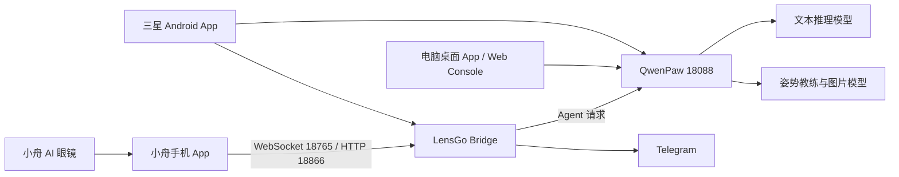

# LensGo × QwenPaw 完整安全交付包使用说明

交付日期：2026-07-26  
适用系统：Windows 10/11；服务端代码也可在 Linux/macOS 上初始化  
项目名称：LensGo × QwenPaw 澳门旅行智能眼镜一体化项目

## 1. 这是什么项目

本项目把两个原有模块整合成一套可在电脑、浏览器和三星 Android 手机上使用的旅行智能眼镜系统：

- `lensgo-macao/`：负责小舟 AI 眼镜接入、WebSocket/HTTP 协议、图片与视频、TTS 回传、旅行记忆、实时事件和 Telegram 镜像。
- `qwen_compitition/`：负责 QwenPaw Agent 运行时、大模型 Provider、Skills、Drivers、长期记忆、旅行规划、相册和可视化 Console。
- 外层 `scripts/`、`config/`、`workspace/` 和 `docs/`：负责统一初始化、启动、桌面 App、Android 构建、测试、文档及运行数据隔离。

系统运行关系：



## 2. 本交付包的完整性结论

本包是从两个本地 Git 工作树的“已跟踪文件 + 未忽略新增文件”逐文件复制得到，不使用可能误删 `src/qwenpaw` 的模糊目录规则。

最终审计结果：

| 范围 | 应包含 | 实际结果 |
|---|---:|---|
| `lensgo-macao` Git 相关文件 | 76 | 0 缺失，0 哈希不一致 |
| `qwen_compitition` Git 相关文件 | 2758 | 0 缺失，0 哈希不一致 |
| `qwen_compitition/src` | 1062 | 全部包含 |
| `qwen_compitition/console/src` | 672 | 全部包含 |
| Android 安全工程文件 | 54 | 已额外包含 |
| 超过 50 MB 的文件 | 0 | 通过 |
| 私钥、GitHub Token、Telegram Token | 0 | 通过 |

关键入口已确认存在：

```text
qwen_compitition/src/qwenpaw/app/_app.py
qwen_compitition/src/qwenpaw/agents/tools/pose_image.py
qwen_compitition/src/qwenpaw/config/config.py
qwen_compitition/console/src/App.tsx
qwen_compitition/console/src-tauri/src/lib.rs
qwen_compitition/console/src-tauri/gen/android/app/src/main/java/io/lensgo/macao/mobile/MainActivity.kt
lensgo-macao/ai_glasses_debug/glasses/server/app.py
lensgo-macao/ai_glasses_debug/glasses/server/qwenpaw_bridge.py
```

## 3. 有意不放进 ZIP 的内容

以下内容不是源码缺失，而是为了安全性、可移植性或体积控制而排除：

- `.env.integrated` 和任何真实 `.env`。
- API Key、Telegram Bot Token、AccessKey、NLS 密钥、Provider 私密配置和凭据 YAML。
- `.venv/`、`node_modules/`、WebView 用户数据、日志、数据库与缓存。
- APK、AAB、`.so`、Rust `target/`、前端 `dist/` 和其他可重新生成的构建产物。
- 两个原仓库的 `.git/` 元数据；本机原仓库及历史没有被修改。
- Android `local.properties`、签名证书和 keystore；这些与具体电脑或发布身份绑定。

因此，接收者需要联网安装依赖并自行填写密钥。任何“附带全部真实密钥、解压即连接现有账号”的 ZIP 都是不安全的。

## 4. 目录结构

```text
Qwen_competion/
├─ lensgo-macao/                 # 眼镜与 Bridge 模块
├─ qwen_compitition/             # QwenPaw、Console、Tauri/Android 源码
├─ config/                       # LensGo 统一配置
├─ docs/                         # 架构、运维、Android、姿势和交接文档
├─ scripts/                      # bootstrap/start/app/test/build_android
├─ tests/                        # 外层一体化测试
├─ workspace/README.md           # 运行数据目录说明
├─ .env.integrated.example       # 无密钥配置模板
├─ README.md                     # 项目总入口
└─ 启动 LensGo App.vbs           # Windows 桌面 App 启动入口
```

## 5. Windows 首次运行

### 5.1 安装依赖

至少需要：

- Python 3.11–3.13。
- Git。
- Node.js 与 npm；建议 Node.js 20 LTS 或兼容版本。
- Windows 桌面 App 需要 Microsoft Edge WebView2，Windows 10/11 通常已安装。

Android 构建还需要 Android Studio、Android SDK、JDK 17、Rust stable 和 Tauri Android 所需 Rust targets。

### 5.2 创建本机配置

在 ZIP 解压后的项目根目录打开 PowerShell：

```powershell
Copy-Item .env.integrated.example .env.integrated
notepad .env.integrated
```

至少为 Bridge 设置一段新的随机 Token：

```dotenv
GLASSES_BRIDGE_TOKEN=请在本机生成一段足够长的随机字符串
```

不要把填写后的 `.env.integrated` 上传 GitHub或重新打进 ZIP。

### 5.3 初始化 Python、Agent 与可视化界面

```powershell
.\scripts\bootstrap.ps1 --build-console
```

初始化会：

1. 创建外层 `.venv`。
2. 以 editable 模式安装 QwenPaw 与 LensGo。
3. 使用 `package-lock.json` 和 `npm ci` 安装、构建 Console。
4. 初始化 `workspace/qwenpaw/`。
5. 创建 LensGo Travel Director、Vision Curator、Memory Keeper、Media Archivist 和 Pose Coach。
6. 安装缺失的自定义 Skill；不会覆盖已有用户配置。

完成后检查：

```powershell
.\.venv\Scripts\python.exe .\scripts\integrated.py doctor
```

`Doctor completed: 0 error(s)` 表示基础结构可以启动。AMap、AI Drive 未配置时显示 `WARN`，它们是可选集成。

## 6. 配置大模型和图片生成

真实 Provider 凭据不在 ZIP 内。初始化后请在 QwenPaw 的模型设置中创建自己的 Provider。

如果使用阿里云 Token Plan 国际版的 OpenAI 兼容方式：

```text
Provider ID：aliyun-tokenplan-intl-custom
Base URL：https://token-plan.ap-southeast-1.maas.aliyuncs.com/compatible-mode/v1
Model ID：qwen3.7-plus
API Key：由接收者自己的阿里云账号提供
```

确保 `.env.integrated` 中的 `QWENPAW_PROVIDER_ID` 和 `QWENPAW_MODEL_ID` 与 QwenPaw 内实际创建的 Provider/Model 一致。

姿势参考图可以使用 DashScope 或 OpenRouter。以 OpenRouter 为例，只在本机 `.env.integrated` 中填写：

```dotenv
POSE_IMAGE_PROVIDER=openrouter
POSE_IMAGE_API_KEY=接收者自己的Key
POSE_IMAGE_BASE_URL=https://openrouter.ai/api/v1
POSE_IMAGE_MODEL=openai/gpt-image-1
POSE_IMAGE_SIZE=1024x1024
```

不配置图片模型时，姿势教练会降级为文字建议，不会导致主 Agent 崩溃。

## 7. 启动电脑 App 和服务

完成 bootstrap 和 Provider 配置后，可以双击：

```text
启动 LensGo App.vbs
```

也可以在 PowerShell 前台启动，方便查看错误：

```powershell
.\scripts\start.ps1
```

默认端口：

| 服务 | 地址 |
|---|---|
| QwenPaw | `http://127.0.0.1:18088` |
| LensGo 眼镜 WebSocket | `ws://127.0.0.1:18765/chat` |
| LensGo HTTP/Bridge | `http://127.0.0.1:18866` |

如果双击没有窗口，先运行：

```powershell
.\.venv\Scripts\python.exe .\scripts\integrated.py doctor
Get-Content .\workspace\logs\qwenpaw-app.log -Tail 100
Get-Content .\workspace\logs\lensgo-app.log -Tail 100
```

## 8. Telegram

在 `.env.integrated` 中填写接收者自己的：

```dotenv
TELEGRAM_BOT_TOKEN=
TELEGRAM_CHAT_ID=
```

留空时 Telegram 会安全跳过，不影响本地 Console、Agent 或眼镜 Bridge。

## 9. Android App

Android 工程源码已包含，但 APK、JNI `.so`、`local.properties` 和签名文件被安全排除。它们可以在新电脑重新生成。

配置 `ANDROID_HOME`/`ANDROID_SDK_ROOT`、JDK 17 和 Rust 后运行：

```powershell
.\scripts\build_android.ps1 -Initialize -DebugBuild
```

手机与电脑通过 USB 调试时：

```powershell
adb devices
adb reverse tcp:18088 tcp:18088
adb reverse tcp:18765 tcp:18765
adb reverse tcp:18866 tcp:18866
```

Android App 只是可视化客户端；Python、QwenPaw、LensGo 和模型仍在电脑或服务器运行。公网部署必须使用 HTTPS/WSS，不能直接公开无鉴权端口。

## 10. 小舟 AI 眼镜

小舟 App 连接 LensGo 后可以发送图片、接收 Agent 回复并播放 TTS。眼镜语音转文字还需要在小舟 App 中填写接收者自己的阿里云智能语音 NLS：

- NLS AppKey。
- RAM AccessKeyId。
- RAM AccessKeySecret。

这些值不属于 Token Plan 模型 Key，也不会包含在本 ZIP 中。未配置或无效时会出现 NLS HTTP 403，图片链路仍可能正常。

## 11. 验证命令

只验证一体化目录：

```powershell
.\.venv\Scripts\python.exe -m pytest .\tests\test_integrated_layout.py -q
```

运行所有集成测试：

```powershell
.\.venv\Scripts\python.exe .\scripts\integrated.py test
```

验证移动端前端：

```powershell
Set-Location .\qwen_compitition\console
npm run build:mobile
```

本次打包前已验证：

- 外层布局：8 项测试和 24 个子测试通过。
- LensGo Bridge 与生成媒体：8 项测试通过。
- QwenPaw 姿势生图：5 项测试通过。
- 移动端前端构建成功。

## 12. 推荐阅读顺序

1. `交付包使用说明.md`：新电脑恢复和安全边界。
2. `README.md`：统一入口。
3. `docs/项目详细说明.md`：整个项目和数据流。
4. `docs/HANDOFF.md`：当前完成状态、真实测试与已知阻塞。
5. `docs/OPERATIONS.md`：启动和故障排查。
6. `docs/MOBILE_APP.md`：Android 架构和连接。
7. `docs/POSE_COACH.md`：姿势与图片生成链路。

## 13. 重要说明

“源码完整”不等于“无需配置任何账号即可调用第三方服务”。本包保证代码、脚本、模板、Android 工程与文档完整；模型、图片、Telegram、NLS、高德和 AI Drive 的真实账号凭据必须由接收者合法提供并仅保存在其本机。
