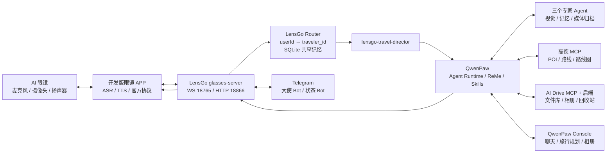

# Qwen Competition 项目模块理解与集成说明

> 历史初始分析：本文记录的是两个仓库刚拉取时的结构与状态。其中“仓库处于干净 main 分支”等表述已不再代表当前集成工作区。当前状态请以 `docs/项目详细说明.md`、`docs/HANDOFF.md` 以及现场 `git status` 为准；不要根据本文的旧状态结论重置或覆盖现有改动。

生成日期：2026-07-23  
本机项目目录：`C:\Users\zhang\Desktop\Project\Qwen_competion`

## 1. 拉取结果

两个模块均已使用 Git 完整克隆，包含 `.git` 历史，并处于干净的 `main` 分支。

| 模块目录 | 实际 GitHub 仓库 | 当前提交 | 跟踪文件 |
|---|---|---|---:|
| `lensgo-macao/` | `https://github.com/zzlkk0/lensgo-macao` | `80e65486b1100d04b3230ec39f684b87ce1de265` | 73 |
| `qwen_compitition/` | `https://github.com/Jimmy-hu-323/qwen_compitition` | `c17175333c8b8094e9342c8b49ea3744665b95ce` | 2748 |

最初提供的两个 URL 各有一处差异：

- `lensgo_macao` 实际为 `lensgo-macao`。
- `Jimmy-323` 实际为 `Jimmy-hu-323`。

两个仓库当前都只有一个 Git 提交，因此属于“完整代码快照式导入”，暂时没有可用于追踪模块演进过程的细粒度提交历史。

## 2. 项目总体定位

这两个仓库不是重复实现，而是同一产品的两个层次：

| 层次 | 模块 | 核心职责 |
|---|---|---|
| 设备与场景接入层 | `lensgo-macao` | 接入 AI 眼镜开发版 APP，处理文字、图片、视频、WebSocket、HTTP、TTS 分片、Telegram 镜像、共享旅行记忆和 LensGo 多 Agent 路由 |
| Agent 平台与业务工作台 | `qwen_compitition` | 提供 QwenPaw Agent 运行时、模型、Skills、MCP/Driver、长期记忆、Web 控制台，并扩展澳门旅行规划、高德路线与 AI Drive 相册 |

一句话概括：

> `lensgo-macao` 负责“眼镜如何把现实世界输入送进 AI、再把回答播出来”，`qwen_compitition` 负责“AI Agent 如何推理、调用工具、记忆、规划行程并提供可视化工作台”。

## 3. 目标运行架构



LensGo 与 QwenPaw 的主要技术边界是 HTTP/SSE，而不是 Python 包内直接调用：

- LensGo 调用 `POST /api/console/chat` 等 QwenPaw Console API。
- 请求头通过 `X-Agent-Id` 指定 `lensgo-travel-director`。
- QwenPaw 用 SSE 流式返回文本。
- LensGo 将 SSE 增量合并成适合 TTS 的 `SCChat` 分片，再经 WebSocket 发回 APP。

## 4. 模块一：`lensgo-macao`

### 4.1 模块定位

这是 LensGo 眼镜端的设备协议适配与旅行陪伴编排模块。主路径基于主办方/官方眼镜联调服务扩展，另保留一个较早的自研 FastAPI Gateway。

根目录关键内容：

| 路径 | 作用 |
|---|---|
| `ai_glasses_debug/` | 当前官方 APP 主路径；包含眼镜服务端、测试客户端、协议、QwenPaw Bridge、Telegram 与测试 |
| `qwenpaw_agents/` | 四个 LensGo Agent 的公开提示词与创建说明 |
| `gateway/` | 旧自研图片上传与 WebSocket Gateway，不是当前官方 APP 主路径 |
| `run_all.sh` | 启动/复用 QwenPaw，再启动眼镜服务、数据 Bridge 和 Telegram |
| `run_qwenpaw.sh` | 用项目内 `.qwenpaw/` 作为 QwenPaw 工作目录，在 `18088` 启动 |
| `run_gateway.sh` | 在 `8000` 启动旧 FastAPI Gateway |
| `.env.bridge.example` | Bridge 与两个 Telegram Bot 的环境变量模板 |
| `LensGo_多Agent旅行记忆架构.md` | 多 Agent、共享记忆与入口说明 |
| `LensGo_眼镜接入与Bridge使用说明.md` | 眼镜协议、接口、FRP、Telegram 和部署说明 |

### 4.2 当前主服务

入口为：

```text
ai_glasses_debug/glasses/server/app.py
```

它同时启动：

- `websockets` 服务：默认 `0.0.0.0:18765/chat`；
- `aiohttp` 服务：默认 `0.0.0.0:18866`；
- 视频上传与媒体读取接口；
- Bearer Token 保护的数据 Bridge；
- LensGo 大使 Telegram Bot；
- 只读工作状态 Telegram Bot。

核心配置在：

```text
ai_glasses_debug/config.toml
```

当前配置把 QwenPaw 指向：

```text
base_url = http://127.0.0.1:18088
agent_id = lensgo-travel-director
```

### 4.3 眼镜协议与数据流

APP 通过 WebSocket `/chat` 连接，Header 必须带：

- `access_token`
- `device_id`

上行统一使用 `CSChatWordImage`，由 `askType` 区分：

| askType | 用途 | 传输 |
|---:|---|---|
| 1 | 文字问答 | WebSocket JSON |
| 2 | 主动图片识别 | WebSocket Base64/Data URL |
| 3 | 意图触发后的拍照识别 | WebSocket Base64/Data URL |
| 4 | 视频分析 | WebSocket 通知 + HTTP multipart 上传 |

服务端主要下行消息：

| 类型 | 用途 |
|---|---|
| `SCChat` | 流式或最终自然语言回答 |
| `SCIntentMessage` | 通知 APP 执行拍照等意图 |
| `SCFinishAIMessage` | 结束会话 |
| `SCError` | 协议或服务错误 |

文字主流程：

1. 校验 WebSocket 路径、Header 和 Token 策略。
2. 从 JWT payload 解出 `userId`。
3. 将 APP 文字发布为 Bridge 上行事件。
4. 写入 LensGo SQLite observation。
5. 注入 `LensGoContext` 和最近五条同用户共享记录。
6. 以固定设备会话 ID 调用 QwenPaw。
7. QwenPaw SSE 输出经 `TtsChunker` 按句号、换行和最大长度切分。
8. 每段封装为 `SCChat`，最后一段 `isEnd=true`。
9. APP 对消息执行 TTS 并从眼镜播放。

图片主流程在上述基础上增加：

1. 解码 Base64/Data URL；
2. 按用户目录保存到 `tmp_media`；
3. 上传到 QwenPaw 文件接口；
4. 构造文本块 + 图片块的多模态请求；
5. 发布视觉专家协作事件。

视频先由 HTTP `/api/chat/resources/upload` 落盘，再上传 QwenPaw，并通过原 WebSocket 异步回推结果。

### 4.4 会话与并发控制

`ws_handler.py` 和 `qwenpaw_bridge.py` 以 `(user_id, device_id)` 作为设备会话键，维护：

- 当前 WebSocket 连接；
- QwenPaw chat/session ID；
- 写锁；
- 正在运行的 SSE Task；
- 是否处于流式回答状态。

同一设备发起新请求时，会先调用 QwenPaw stop API 并取消旧 Task，避免两个回答交叉发送。写锁保证 APP 和 Telegram 共同写同一设备 WebSocket 时不互相穿插。

### 4.5 共享旅行记忆

实现位于：

```text
ai_glasses_debug/glasses/server/lensgo_memory.py
```

数据库位置按当前配置推导为：

```text
ai_glasses_debug/data/lensgo_memory.db
```

SQLite 表：

| 表 | 用途 |
|---|---|
| `travelers` | `traveler_id`、原始 `user_id`、显示名、偏好 |
| `observations` | 每次请求的来源、模态、文本、媒体引用与时间 |
| `moments` | 重要时刻候选、重要度和媒体引用 |

`traveler_id` 是 `SHA-256(user_id)` 的前 16 个十六进制字符，并加 `traveler_` 前缀。模型看到稳定的伪匿名 ID，不把原始 `userId` 当作用户姓名。

当前实现的实际边界：

- 已实现 observation 记录和最近五条记录注入；
- `preferences` 当前仍固定返回空对象；
- `moments` 表已建，但核心代码尚未看到写入流程；
- 这是 Router 内部 SQLite 适配层，不是 MCP Server；
- 各 QwenPaw Agent 仍各自拥有 ReMe 私有长期记忆。

### 4.6 四个 LensGo Agent

| Agent ID | 职责 |
|---|---|
| `lensgo-travel-director` | 唯一面向用户的主 Agent；输出 1–3 句、默认不超过 120 字、适合眼镜朗读 |
| `lensgo-vision-curator` | 场景、光线、构图、安全、互动和纪念价值；禁止凭人脸推断敏感身份 |
| `lensgo-memory-keeper` | 按 `traveler_id` 整理偏好、旅程、同行关系、事实/推断/未知和重要时刻候选 |
| `lensgo-media-archivist` | 媒体去重、归属、保留期限、隐私和删除建议 |

主 Agent 需要 QwenPaw 的 `multi_agent_collaboration` Skill，通过 `chat_with_agent`/`submit_to_agent` 调用三个专家。专家结果是内部材料，不直接返回 APP。

仓库仅保存安全的 `AGENTS.md` 与 `SOUL.md`。运行所需的 `agent.json`、模型密钥、聊天历史和私有记忆不在 Git 中，因此首次部署仍需执行 `qwenpaw agents create` 并把提示文件放入对应工作区。

### 4.7 数据 Bridge 与 Telegram

`EventBridge` 是进程内事件总线：

- 使用有界 `deque` 保存最近事件，默认 200 条；
- 支持多个异步 Queue 订阅者；
- Queue 满时丢弃最旧事件；
- 对外历史最大返回 500 条。

接口：

- `GET /api/bridge/events`
- `WS /api/bridge/ws`
- `GET /api/bridge/media/{user_id}/{filename}`

Bridge Token 来自 `GLASSES_BRIDGE_TOKEN`，不会从 TOML 直接写死。公开事件不包含绝对媒体路径，但仍包含原始 `user_id`；如果需要更强隐私，应考虑对 Bridge 输出也使用 `traveler_id`。

两个 Telegram Bot：

- 大使 Bot：可接收文字和照片，并复用当前在线眼镜设备的 QwenPaw 会话；
- 状态 Bot：只显示设备上线、Router、Agent 协作和错误，不接受生活对话。

大使 Bot 不是独立会话：设备必须在线，Telegram 输入会同时进入原 APP 会话，最终 `SCChat` 也会回到 APP 并由眼镜 TTS 播放。

### 4.8 旧 Gateway

`gateway/app.py` 是一个简单 FastAPI 服务：

- `POST /api/v1/glasses/upload`
- `WS /ws/v1/glasses/{device_id}`
- `GET /health`

它只完成 JPEG/PNG/WebP 校验和落盘，没有接入当前多 Agent、SQLite 共享记忆或官方 APP 协议。项目文档已明确它不是当前主路径。

### 4.9 安全与部署边界

当前眼镜服务的 JWT 逻辑只解码 payload：

- 不验签；
- 不校验 `exp`；
- TOML 默认 Token 策略为 `allow_any`。

源码也明确标注这只适用于本地/联调。生产部署必须在可信业务网关完成 JWT 验签和过期检查，或在此服务中补齐验证；否则攻击者可以伪造 `userId`。

此外：

- `0.0.0.0` 暴露服务时要有防火墙、TLS 和访问控制；
- Bridge Token、Telegram Token、QwenPaw Key 不能入 Git；
- 媒体当前会保存在 `tmp_media`，尚未实现自动过期清理；
- 公网文档中使用 `ws/http`，生产应升级为 `wss/https`。

### 4.10 测试现状

仓库有 11 个 `test_*.py`，覆盖协议、JWT payload 解析、配置、媒体解码、Bridge、共享记忆、Telegram 和 TTS 分片等。此次只完成源码分析，没有安装依赖或运行测试。

## 5. 模块二：`qwen_compitition`

### 5.1 模块定位

该仓库是 QwenPaw `2.0.0.post3` 的完整源码快照，在通用个人 Agent 工作台之上加入澳门旅行规划和 AI Drive 相册。

技术栈：

- 后端：Python 3.11–3.13、FastAPI、Uvicorn、AgentScope 2.0、ReMe、MCP；
- 前端：React 18、TypeScript、Vite、Ant Design、Leaflet；
- 扩展：Skills、Driver 卡片、MCP stdio/HTTP、插件、多 Agent、定时任务、多渠道；
- 数据：每 Agent 独立工作区、会话状态、Scroll 历史、ReMe 长期记忆、凭据存储。

### 5.2 QwenPaw 核心运行架构

入口：

```text
qwenpaw app → qwenpaw.cli.app_cmd → uvicorn → qwenpaw.app._app:app
```

`DynamicMultiAgentRunner` 根据请求的 Agent Context，从 `WorkspaceRegistry` 取得对应工作区，然后为每个请求创建 `Runtime`。

每次请求的大体生命周期：

1. 解析目标 Agent 和会话；
2. 从工作区读取 Agent 配置、启用的 Skills、Drivers 和治理策略；
3. `AgentBuilder` 构造模型、系统提示、Toolkit、记忆和中间件；
4. 创建 `QwenPawAgent`；
5. 执行 ReAct/Loop 推理；
6. 工具调用经过 Policy/Approval Guard；
7. 流式输出封装为 Console API 事件；
8. 持久化会话、Scroll 历史和长期记忆；
9. 在取消/错误路径也尽力保存 Agent 状态。

系统提示不是单一字符串，而是由贡献器组合：

- Agent Identity；
- 工作区 `AGENTS.md`；
- `SOUL.md`；
- `PROFILE.md`；
- 环境上下文；
- Skills 与 Driver 提示；
- ReMe 记忆指引。

### 5.3 Skills、Drivers 与 MCP

Skills 负责告诉 Agent“何时触发、按什么业务流程执行”；Driver/MCP 负责提供真正可调用的外部工具。

`DriverManager`：

- 从工作区 `drivers/` 扫描持久化 Driver 卡片；
- 管理启用/禁用、重载、连接和关闭；
- 支持凭据引用，不要求把密钥直接写进 YAML；
- 当前实际协议实现以 MCP 为主；
- 把 MCP tools 转换成协议中立的 Driver capabilities；
- 每次工具调用经过 allow/deny/ask 策略。

MCP 支持：

- stdio 子进程；
- HTTP 类传输；
- 环境变量/Header 凭据绑定；
- 工具列表缓存；
- 调用审批与按主体/渠道的策略判断。

### 5.4 记忆

QwenPaw 自身提供两类与本项目相关的记忆：

- Scroll/历史：逐轮持久化完整对话，旧内容可按需召回；
- ReMe Light：长期记忆提取与 `memory_search` 工具。

这与 LensGo SQLite 的关系是：

- LensGo SQLite：跨“眼镜 + Telegram 入口”的轻量、用户级共享上下文；
- QwenPaw ReMe：每个 Agent 自己的长期语义记忆；
- 二者目前并未合并为同一数据库。

### 5.5 澳门旅行规划 Skill

预置位置：

```text
working/workspaces/default/skills/macau_trip_planner/SKILL.md
```

并在 `skill.json` 中标记为：

- `enabled: true`
- `channels: ["all"]`
- `source: customized`
- 版本 `1.1`

规划流程是明确的有限状态业务流程：

1. 分轮收集天数、住宿/起点、同行人、步行能力、兴趣、预算和交通偏好；
2. 每轮最多问两个问题；
3. 信息足够后先展示固定字段的“行程确认”；
4. 未经确认不得生成最终路线；
5. 确认后为每个地点调用高德 POI 搜索；
6. 每天最多 10 个地点；
7. 用一次 `amap_build_itinerary` 计算整次分日行程；
8. 保留工具返回的到达/离开时间、距离和时长；
9. 对每个 `map_file_path` 使用 `send_file_to_user` 发图；
10. 修改某一天时保留其他天，只重排受影响日。

业务约束还包括：

- 地理上连续，减少澳门半岛、氹仔和路环往返；
- 时效性信息未经验证时必须提示出发前确认；
- 不把地图 Key、内部路径和 URL 告诉用户；
- 不使用 AI Drive 生成或解释行程。

### 5.6 高德 MCP

Driver 卡片：

```text
working/workspaces/default/drivers/mcp/amap-macau.yaml
```

外部依赖并不在本仓库中，而是引用：

```text
/home/jimmyhu/Desktop/amap-mcp/server.py
```

预期能力：

- POI 搜索；
- 真实路线计算；
- 分日行程排程；
- 每日路线图生成；
- 在 `travel_maps/` 写入 `latest-itinerary.json` 和 PNG。

需要注意一个配置差异：

- Skill 明确要求调用 `amap_build_itinerary`；
- YAML 的显式 allow 规则只列出 `amap_search_poi`、`amap_plan_route` 和 `amap_render_route_map`；
- `default_effect` 为 `ask`，因此 `amap_build_itinerary` 可能触发审批，而不是自动允许。

如果比赛演示要求全自动，应在确认实际 MCP 工具名后补充精确 allow 规则；不要把整个 Driver 改成无条件放行。

### 5.7 旅行规划后端 API

实现：

```text
src/qwenpaw/app/routers/travel_planner.py
```

主要接口：

| 接口 | 作用 |
|---|---|
| `GET /travel-planner/latest` | 读取最新 `latest-itinerary.json`，过滤本地绝对路径 |
| `GET /travel-planner/route` | 服务端调用高德方向 API，返回真实道路折线 |
| `GET /travel-planner/album/photos` | 代理 AI Drive 图片时间线 |
| `GET /travel-planner/album/photos/{id}/image` | 由 QwenPaw 代理图片内容 |
| `POST /travel-planner/album/photos` | 上传图片到 AI Drive，单张最大 20 MB |
| `DELETE /travel-planner/album/photos/{id}` | 调用 AI Drive 软删除，移入回收站 |

路线折线会以 `mode + origin + destination` 为键缓存到：

```text
working/workspaces/default/media/travel_maps/route-cache.json
```

这样前端重复查看行程不会持续消耗高德额度。高德 Key 只在服务端环境或 `.env` 中读取，不发送到浏览器。

### 5.8 旅行规划前端

实现：

```text
console/src/pages/TravelPlanner/index.tsx
```

功能：

- 每 20 秒轮询最新行程，也支持手动刷新；
- 左侧按天切换；
- 中间用 Leaflet + 高德 GCJ-02 瓦片显示地图；
- 逐段从后端获取真实道路折线；
- 真实路线未返回时先画虚线直连作为降级；
- 编号 Marker 与右侧活动时间线联动；
- 显示到达/离开时间、停留时长、交通方式、距离和在途时间；
- 底图失败时仍保留路线和 Marker。

前端使用高德公开瓦片地址，浏览器仍需能访问外网；后端方向 API 也需要高德 Web 服务 Key。

### 5.9 AI Drive 存储 Skill

预置位置：

```text
working/workspaces/default/skills/qwenpaw_ai_drive_storage/SKILL.md
```

核心原则：

> QwenPaw 负责读取、分析、分类和总结；AI Drive 只负责持久化与可视化。

对每个附件：

1. QwenPaw 使用自己的文件工具和适用 Skill 读取；
2. 生成分类、虚拟路径、摘要、标签、关键点和问题；
3. 对原始附件只调用一次 `ai_drive_store_from_qwenpaw`；
4. 返回 AI Drive 中的分类与路径。

明确禁止把解析、问答、Embedding、索引或分类再次交给 AI Drive，避免两个 AI 系统重复分析或结论冲突。

### 5.10 AI Drive MCP 与相册

Driver 卡片：

```text
working/workspaces/default/drivers/mcp/ai-drive.yaml
```

它引用本仓库外的：

```text
/home/jimmyhu/Desktop/ai-drive-mcp/server.py
```

并依赖单独运行的 AI Drive 后端，文档默认地址为：

```text
http://127.0.0.1:8000
```

相册前端：

```text
console/src/pages/TravelAlbum/index.tsx
```

功能：

- 按 EXIF 拍摄时间倒序；
- 无拍摄时间时用上传时间；
- 分日期分组；
- 展示相机、GPS 是否存在、摘要和标签；
- 多图上传；
- 删除操作为 AI Drive 软删除；
- 图片经 QwenPaw 服务端代理，远程浏览器无需直接访问 AI Drive 内网地址。

### 5.11 构建与运行现状

仓库没有已构建的：

```text
src/qwenpaw/console/index.html
```

因此从源码运行前仍要：

1. 在 `console/` 执行 `npm ci`；
2. 执行 `npm run build`；
3. 把 `console/dist/` 复制到 `src/qwenpaw/console/`，或让运行时直接找到 `console/dist`；
4. 安装 Python 包。

当前仓库有 294 个 `test_*.py`，覆盖通用 QwenPaw 的大量功能；但没有搜索到旅行规划、相册或 AI Drive 定制代码对应的自动化测试。此次没有安装依赖或运行测试。

## 6. 两个模块当前尚未自动连通的地方

### 6.1 QwenPaw 工作目录不同

LensGo 的 `run_qwenpaw.sh` 强制：

```text
QWENPAW_WORKING_DIR=<lensgo-macao>/.qwenpaw
```

而 `qwen_compitition` 的定制 Skill 和 MCP 卡片位于：

```text
<qwen_compitition>/working/workspaces/default/
```

这意味着：

- 运行 LensGo 自带脚本时，不会自动读取 `qwen_compitition/working`；
- 运行 `qwen_compitition` 的 `working` 时，也不会自动存在四个 LensGo Agent；
- 两边需要选择同一个正式 `QWENPAW_WORKING_DIR`，再把 Agent、Skills 和 Drivers 安装到正确的 Agent 工作区。

### 6.2 Skill 只启用在 `default` Agent

澳门旅行规划和 AI Drive Skill 当前只预置在 `default` 工作区。LensGo 请求指定的是：

```text
X-Agent-Id: lensgo-travel-director
```

所以 `lensgo-travel-director` 不会天然拥有这两个 Skill。需要明确决定：

- 让主 Agent 直接启用 `macau_trip_planner` 与 `qwenpaw_ai_drive_storage`；或
- 主 Agent 通过多 Agent 协作调用一个专门拥有这些 Skills 的规划 Agent。

第二种隔离更清晰，但需要配置专门 Agent 和调用协议。

### 6.3 端口不一致

- LensGo 期望 QwenPaw：`18088`；
- `qwen_compitition/START_LOCAL.md` 示例使用：`8092`；
- QwenPaw 默认端口：`8088`。

必须统一。对现有 LensGo 配置最少改动的做法是让定制 QwenPaw 在 `18088` 启动。

### 6.4 `8000` 端口冲突

- LensGo 旧 Gateway 默认使用 `8000`；
- AI Drive 后端文档也使用 `8000`。

二者不能在同一主机同时占用该端口。由于旧 Gateway 不是当前官方 APP 主路径，联合运行时应保持它关闭，或改到其他端口。

### 6.5 Linux 绝对路径与当前 Windows 环境

当前以下文件包含 `/home/...` 绝对路径：

- `qwen_compitition/START_LOCAL.md`
- `working/workspaces/default/drivers/mcp/amap-macau.yaml`
- `working/workspaces/default/drivers/mcp/ai-drive.yaml`
- `src/qwenpaw/app/routers/travel_planner.py` 的默认 `AMAP_ENV_FILE`
- LensGo 的 Bash 启动文档和 FRP 路径

当前电脑是 Windows，不能原样运行这些路径。需要选择：

- 在 WSL/Linux 中部署，并改成实际 WSL 路径；或
- 原生 Windows 部署，把 Driver 的 `command`、`args`、输出目录和 `.env` 路径改成 Windows 绝对路径。

### 6.6 外部仓库/服务未包含

完整功能还依赖：

- 官方开发版眼镜 APP；
- `amap-mcp/server.py`；
- 高德 Web 服务 Key；
- `ai-drive-mcp/server.py`；
- AI Drive 后端；
- 模型 Provider 与 API Key；
- 可选 Telegram Bot；
- 可选 FRP 公网映射。

这两个 Git 仓库本身不能单独提供全部比赛演示链路。

## 7. 推荐的统一部署方式

建议只运行一个 QwenPaw 实例，把两个模块接到同一个工作目录。

推荐目标：

```text
QwenPaw 源码：qwen_compitition/
QWENPAW_WORKING_DIR：统一的 working/
QwenPaw 端口：18088
眼镜服务：lensgo-macao/ai_glasses_debug
```

实施顺序：

1. 构建并安装 `qwen_compitition` 中的 QwenPaw 源码。
2. 选定唯一 `QWENPAW_WORKING_DIR`。
3. 在该目录创建四个 LensGo Agent。
4. 安装对应 `AGENTS.md` 与 `SOUL.md`。
5. 给 `lensgo-travel-director` 启用 `multi_agent_collaboration`。
6. 决定旅行规划与 AI Drive Skills 是直接给主 Agent，还是给独立规划 Agent。
7. 把两个 MCP Driver 卡片中的 Linux路径改成实际路径。
8. 配置凭据存储，不把 Key 写入 Git。
9. 让 QwenPaw 在 `127.0.0.1:18088` 启动。
10. 保持 LensGo `config.toml` 指向该实例。
11. 启动眼镜服务 `18765/18866`。
12. 最后接入 APP、Telegram 和公网映射。

## 8. 当前最重要的联调验证项

建议下一步按以下顺序验证：

1. QwenPaw 控制台能启动并显示定制的“旅行规划”和“相册”菜单。
2. `lensgo-travel-director` 能通过 `X-Agent-Id` 被 `/api/console/chat` 正确选中。
3. 主 Agent 能调用三个专家 Agent。
4. `LensGoContext` 能跨眼镜和 Telegram 注入同一 `traveler_id`。
5. 文字 SSE 能被正确切成 `SCChat` 且只有最后一段 `isEnd=true`。
6. 图片和视频能上传 QwenPaw 并返回多模态回答。
7. `macau_trip_planner` 只在用户确认后调用高德工具。
8. `amap_build_itinerary` 的策略是否会弹审批。
9. `latest-itinerary.json` 能被旅行规划页读取。
10. AI Drive 相册能读取、上传和软删除图片。
11. 眼镜 JWT 在进入公网前完成真正验签。
12. 媒体临时文件具备可配置的清理策略。

## 9. 本次操作边界

本次已完成：

- 修正两个实际仓库地址；
- 完整 Git 克隆到目标目录；
- 核对分支、提交、远程和工作区状态；
- 阅读两个模块的入口、配置、核心数据流、Agent、Skills、MCP、前后端定制和关键测试；
- 生成本说明文档。

本次未执行：

- 安装 Python/Node 依赖；
- 构建前端；
- 启动任何项目服务；
- 运行自动化测试；
- 修改源码、端口、路径或凭据；
- 接入外部 AI Drive、高德、Telegram、FRP 或眼镜 APP。

因此当前状态是“代码已完整落盘并完成架构理解”，尚不是“已部署运行”。
